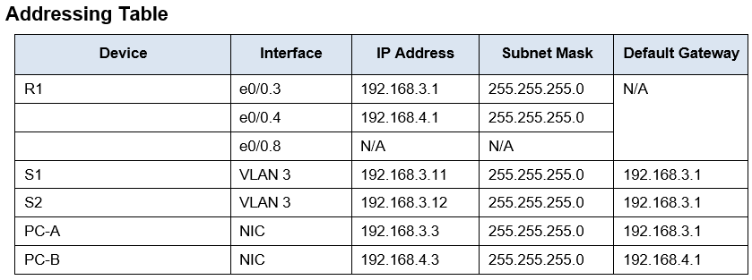
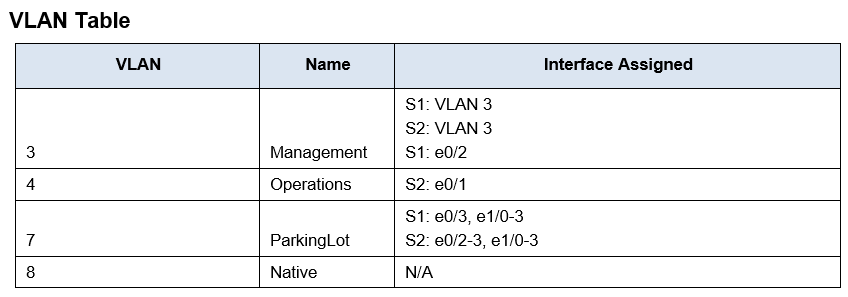
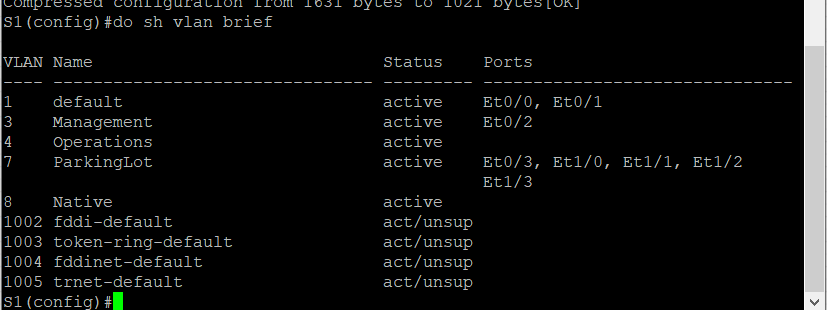
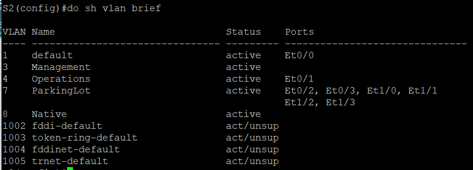
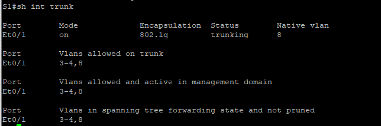
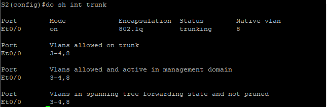
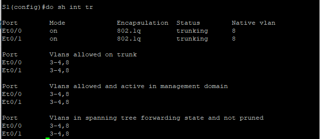
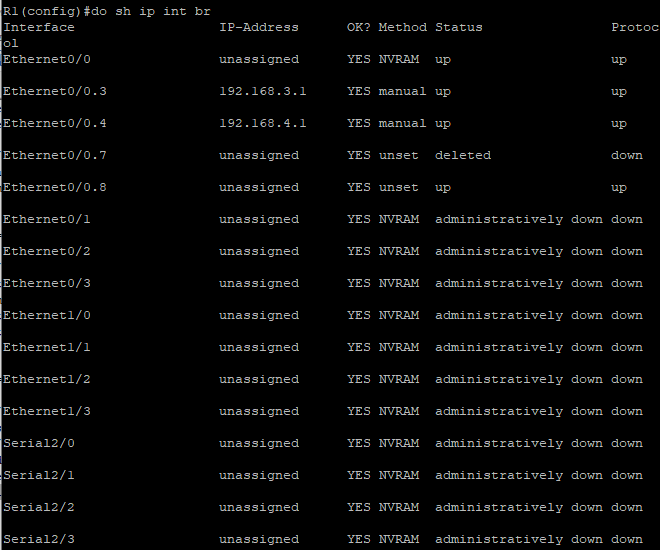
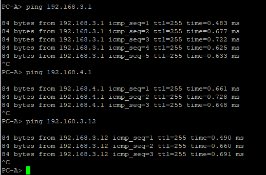
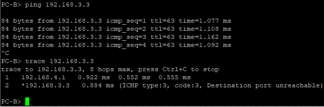

# Configure Router-on-a-Stick Inter-VLAN Routing

Топология сети для данной работы:


Таблица адресов:



Таблица VLAN:



Objectives
- [Configure Router-on-a-Stick Inter-VLAN Routing](#configure-router-on-a-stick-inter-vlan-routing)
  - [Part 1: Build the Network and Configure Basic Device Settings](#part-1-build-the-network-and-configure-basic-device-settings)
    - [Step 2: Configure basic settings for the router.](#step-2-configure-basic-settings-for-the-router)
    - [Step 3: Configure basic settings for each switch.](#step-3-configure-basic-settings-for-each-switch)
  - [Part 2: Create VLANs and Assign Switch Ports](#part-2-create-vlans-and-assign-switch-ports)
    - [Step 1: Create VLANs on both switches.](#step-1-create-vlans-on-both-switches)
    - [Step 2: Assign VLANs to the correct switch interfaces.](#step-2-assign-vlans-to-the-correct-switch-interfaces)
  - [Part 3: Configure an 802.1Q Trunk Between the Switches](#part-3-configure-an-8021q-trunk-between-the-switches)
    - [Step 1: Manually configure trunk interface e0/1](#step-1-manually-configure-trunk-interface-e01)
    - [Step 2: Manually configure S1’s trunk interface e0/0](#step-2-manually-configure-s1s-trunk-interface-e00)
  - [Part 4: Configure Inter-VLAN Routing on the Router](#part-4-configure-inter-vlan-routing-on-the-router)
  - [Part 5: Verify Inter-VLAN Routing is Working](#part-5-verify-inter-vlan-routing-is-working)
    - [Step 1: Complete the following tests from PC-A. All should be successful.](#step-1-complete-the-following-tests-from-pc-a-all-should-be-successful)
    - [Step 2: Complete the following test from PC-B.](#step-2-complete-the-following-test-from-pc-b)

## Part 1: Build the Network and Configure Basic Device Settings
### Step 2: Configure basic settings for the router.
---
Команды, введённые на данном этапе:
```
Router>en
Router#conf t
Router(config)#hostname R1
R1(config)#no ip domain-lookup
R1(config)#
R1(config)#enable secret class
R1(config)#
R1(config)#line console 0
R1(config-line)#login
R1(config-line)#password cisco
R1(config-line)#exit
R1(config)#
R1(config)#line vty 0 4
R1(config-line)#login
R1(config-line)#password cisco
R1(config-line)#exit
R1(config)#
R1(config)#service password-encryption
R1(config)#banner login *unauthorized access is prohibited*
R1(config)#
R1(config)#clock timezone UTC +3 0
R1(config)#
R1(config)#do write memory
R1(config)#
```
### Step 3: Configure basic settings for each switch.
---
Для настроек S1 и S2 были использованы те же команды, отличия только в имени устройства для команды *hostname*.

## Part 2: Create VLANs and Assign Switch Ports
### Step 1: Create VLANs on both switches.
---
Команды, введённые на данном этапе:
```
S1(config)#vtp mode transparent
S1(config)#
S1(config)#vlan 3
S1(config-vlan)#name Management
S1(config)#
S1(config)#vlan 4
S1(config-vlan)#name Operations
S1(config)#
S1(config)#vlan 7
S1(config-vlan)#name ParkingLot
S1(config)#
S1(config)#vlan 8
S1(config-vlan)#name Native
S1(config)#
S1(config)#
S1(config)#int vlan 3
S1(config-if)#ip addr 192.168.3.11 255.255.255.0
S1(config)#ip default-gateway 192.168.3.1
S1(config)#
S1(config)#int range e0/3, e1/0-3
S1(config-if-range)#sw mode access
S1(config-if-range)#sw access vlan 7
S1(config-if-range)#shutdown
S1(config-if-range)#ex
S1(config)#
```

Различия между S1 и S2 были, во-первых, в диапазоне портов, которые были определены в 7 VLAN, и, во-вторых, в ip-адресе, прописанном на интерфейсе VLAN 3 (порты и ip-адреса представлены в [таблице адресов](addrTable.png))

### Step 2: Assign VLANs to the correct switch interfaces.
---
Команды для S1:
```
S1(config)#int e0/2
S1(config-if)#sw access vlan 3
S1(config-if)#sw mode access
```
Команды для S2:
```
S2(config)#int e0/1
S2(config-if)#sw access vlan 4
S2(config-if)#sw mode access
```

Результаты настройки VLAN

Для S1



Для S2



## Part 3: Configure an 802.1Q Trunk Between the Switches
### Step 1: Manually configure trunk interface e0/1
---
Команды, введённые на данном этапе (для обоих свичей):
```
S1(config)#int e0/1
S1(config-if)#sw trunk encapsulation dot1q
S1(config-if)#sw mode trunk
S1(config-if)#sw trunk native vlan 8
S1(config-if)#sw trunk allowed vlan 3,4,8
S1(config)#
```
Результат применения команды *show interface trunk*:

Для S1



Для S2



### Step 2: Manually configure S1’s trunk interface e0/0
---
Команды, применённые для настройки trunk на данном этапе аналогичны командам из Step 1. 

Результат применения команды *show interface trunk*:



**Why does F0/5 not appear in the list of trunks?** – на момент выполнения задания при настройке интерфейса он изначально без дополнительных действий отображается в таблице при использовании команды *show interfaces trunk*. Но если его выключить командой *shutdown*, то из таблицы он пропадёт. Предположу, что порт изначально не поднимался сам, из-за чего в таблице его не было.

## Part 4: Configure Inter-VLAN Routing on the Router

Команды, введённые на данном этапе:
```
R1(config)#int e0/0
R1(config-if)#no sh
R1(config)#
R1(config)#int e0/0.3
R1(config-subif)#description Management
R1(config-subif)#encapsulation dot1Q 3
R1(config-subif)#ip addr 192.168.3.1 255.255.255.0
R1(config)#
R1(config)#int e0/0.4
R1(config-subif)#description Operations
R1(config-subif)#encapsulation dot1Q 4
R1(config-subif)#ip addr 192.168.4.1 255.255.255.0
R1(config)#
R1(config)#int e0/0.8
R1(config-subif)#description Native
R1(config-subif)#encapsulation dot1Q 8
R1(config)#
```
Результат применения команды *show ip interface brief*:



## Part 5: Verify Inter-VLAN Routing is Working
### Step 1: Complete the following tests from PC-A. All should be successful.

Проверка наличия связи с gateway, PC-B и S2:



### Step 2: Complete the following test from PC-B.

Результат работы команды traceroute на PC-B:



**What intermediate IP addresses are shown in the results?** - ip-адрес маршрутизатора (точнее, сабинтерфейса на этом маршрутизаторе, "отвечающего" за маршрутизацию пакетов этого vlan), через который проходят пакеты в процессе передачи с PC-A на PC-B.
