# Развертывание коммутируемой сети с резервными каналами
 
 Топология сети для данной работы:

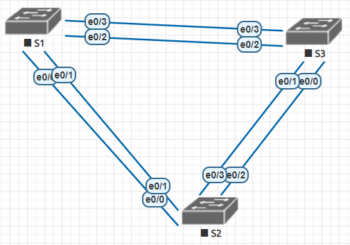

Таблица адресов:

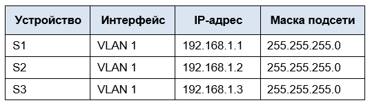

Цели
- [Часть 1:	Создание сети и настройка основных параметров устройства](#часть-1-создание-сети-и-настройка-основных-параметров-устройства)
- [Часть 2: Определение корневого моста](#часть-2-определение-корневого-моста)
- [Часть 3: Наблюдение за процессом выбора протоколом STP порта, исходя из стоимости портов](#часть-3-наблюдение-за-процессом-выбора-протоколом-stp-порта-исходя-из-стоимости-портов)
- [Часть 4: Наблюдение за процессом выбора протоколом STP порта, исходя из приоритета портов](#часть-4-наблюдение-за-процессом-выбора-протоколом-stp-порта-исходя-из-приоритета-портов)

## Часть 1:	Создание сети и настройка основных параметров устройства

### Шаг 1-3 (Создайте сеть согласно топологии. Выполните инициализацию и перезагрузку коммутаторов. Настройте базовые параметры каждого коммутатора)
---
Работа по сборке сети и настройке коммутаторов повторяет таковую в первой лабораторной, поэтому подробности опущены.

Итогм стала сеть, представленная в [начале работы](#развертывание-коммутируемой-сети-с-резервными-каналами)

### Шаг 4. Проверьте связь.
---
Проверка корректности настроек:

Для S1  
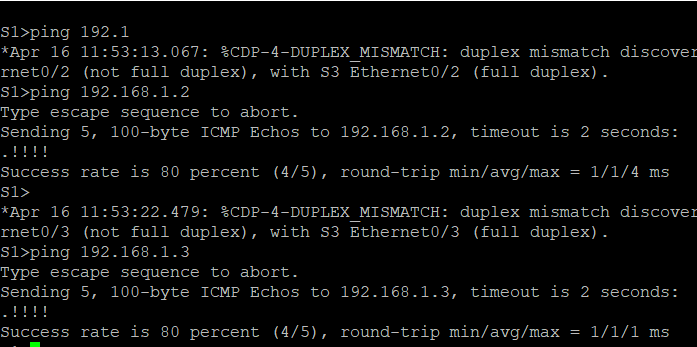

Для S2  
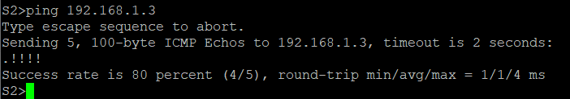

## Часть 2:	Определение корневого моста.

### Шаг 1-3 (Отключите все порты на коммутаторах. Настройте подключенные порты в качестве транковых. Включите порты F0/0 и F0/2 на всех коммутаторах)
---
Команды, введённые на данном этапе (для всех свичей):

```
S1(config)#int range e0/0-3, e1/0-3
S1(config-if-range)#shutdown
S1(config-if-range)#sw mode trunk
S1(config)
S1(config)
S1(config)#int range e0/0, e0/2
S1(config-if-range)#no shutdown
```

### Шаг 4:	Отобразите данные протокола spanning-tree.
---

Результат применения команды *show spanning tree*:

Для S1  
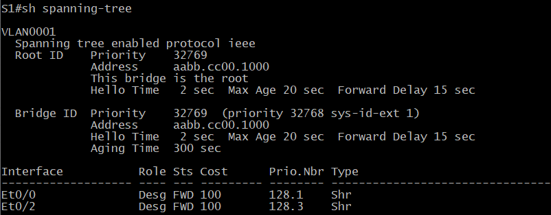

Для S2  
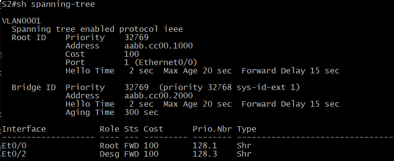

Для S3  
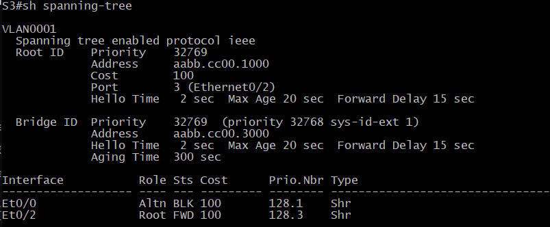

Схема ролей и состояний активных портов коммутаторов в топологии:  
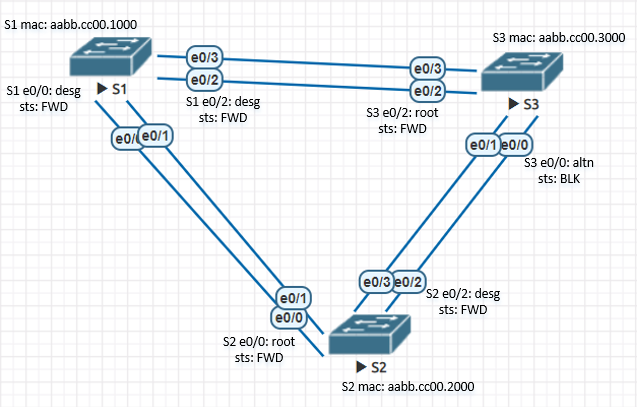

**ВОПРОСЫ**

*A: Какой коммутатор является корневым мостом?*  
Q: Коммутатор S1.

*A: Почему этот коммутатор был выбран протоколом spanning-tree в качестве корневого моста?*  
Q: Потому что этот коммутатор имеет наименьший Bridge ID, а если точнее – burned-in MAC. Так как дополнительных настроек не производилось, то Bridge priority у всех равны (т.к. имеют одниковые значения, установленные по умолчанию). Кроме того, System ID Extension тоже одинаков – так как VLAN, для которого строится дерево, один и тот же. Следовательно, оцениваются значения system MAC, который меньше у первого коммутатора (так как в условиях эмуляции он самый «старый»). 
  
*A: Какие порты на коммутаторе являются корневыми портами?*  
Q: Те, у которых наиболее короткий и «дешёвый» путь до корневого коммутатора (грубо говоря, это «путь вверх по дереву»). Так как S1 – корневой мост, у него таких портов нет. На S2 это порт e0/0, на S3 это e0/2.

*A: Какие порты на коммутаторе являются назначенными портами?*   
Q: Те, которые имеют наилучший путь отправки данных, идущих к корневому мосту, или же порт, принимающий трафик из сегмента сети (грубо говоря, это «путь вниз по дереву»). Так как S1 корневой мост, то все его порты назначенные. На S2 это порт e0/2, на S3 таких нет.

*A: Какой порт отображается в качестве альтернативного и в настоящее время заблокирован?*  
Q: Порт e0/0 на S3.

*A: Почему протокол spanning-tree выбрал этот порт в качестве невыделенного (заблокированного) порта?*  
Q: Потому что этот порт имеет наибольший Bridge ID. При выборе из портов e0/2 на S2 и e0/0 на S3 происходило последовательное сравнение сначала стоимостей пути, которая оказалась одинаковой, т.к. скорость портов одинаковая, а референс один и тот же, т.к. назначен по умолчанию и не изменялся. Поэтому затем сравнивались Bridge ID коммутаторов-владельцев портов, и у S3 он оказался больше (т.к. в условиях эмуляции он самый «новый»), следовательно, он и стал заблокированным.

## Часть 3:	Наблюдение за процессом выбора протоколом STP порта, исходя из стоимости портов

### Шаг 1:	Определите коммутатор с заблокированным портом.
Для поиска была введена команда *show spanning tree*, в результате был найден нужный свич - S3.  

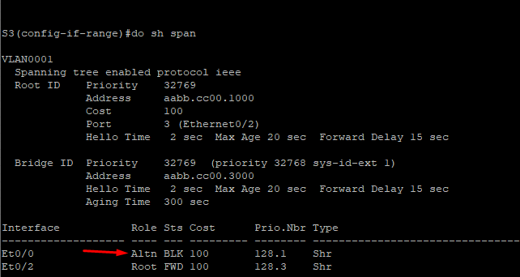

### Шаг 2:	Измените стоимость root-порта этого коммутатора.
---
Команды, введённые на данном этапе:

```
S3(config)#int e0/2
S3(config-if)#spanning-tree cost 18
```

### Шаг 3:	Просмотрите изменения протокола spanning-tree.
---
Результат применения команды *show spanning tree*:

Для S2  
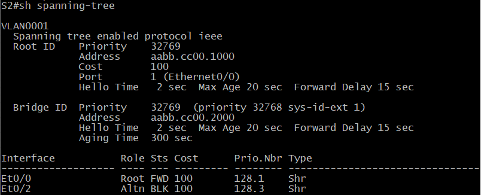

Для S3  
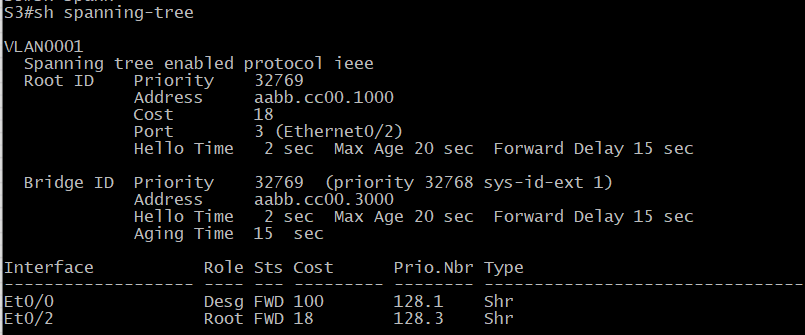

*A: Почему протокол spanning-tree заменяет ранее заблокированный порт на назначенный порт и блокирует порт, который был назначенным портом на другом коммутаторе?*  
Q: Потому что Root Path Cost у root-порта на S3 была изменена вручную на более маленькую – и при выборе назначенного порта сравнение шло не как раньше, по Bridge ID, а по cost, и у e0/0 на S3 она стала равна 18 (0 от root bridge + 18 от e0/2), а у e0/2 на S2 – 100 (0 от root bridge + 100 от e0/0). Так как cost меньше у e0/0 на S3, он изменил роль и стал назначенным, а более «дорогой» порт e0/2 на S2 блокируется.

## Часть 4:	Наблюдение за процессом выбора протоколом STP порта, исходя из приоритета портов

Результат работы протокола STP при включении избыточных линков:

Для S2  
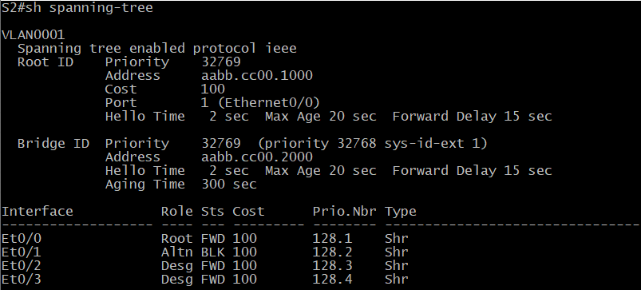

Для S3  
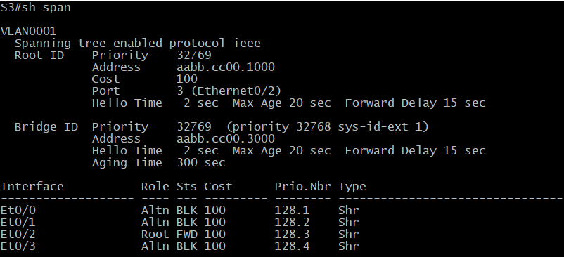

*A: Какой порт выбран протоколом STP в качестве порта корневого моста на каждом коммутаторе некорневого моста?*  
Q: Портом корневого моста на свиче S2 выбран e0/0, а на свиче S3 – e0/2.

*A: Почему протокол STP выбрал эти порты в качестве портов корневого моста на этих коммутаторах?*  
Q: Потому что при сравнении портов у выбранных оказалась меньшая стоимость пути до моста, Bridge ID, поэтому сравнение шло по Port ID порта соседнего коммутатора, который у выбранных портов был наименьшим из сравниваемых.  

**Проверка:**

Топология та же, работа идёт с S2 и S1(попытка поменять root-порт на S2)

До начала изменения Port ID портов S1:  

```
S2#show spanning-tree
VLAN0001
  Spanning tree enabled protocol ieee
  Root ID    Priority    32769
             Address     aabb.cc00.1000
             Cost        100
             Port        1 (Ethernet0/0)
             Hello Time   2 sec  Max Age 20 sec  Forward Delay 15 sec
  Bridge ID  Priority    32769  (priority 32768 sys-id-ext 1)
             Address     aabb.cc00.2000
             Hello Time   2 sec  Max Age 20 sec  Forward Delay 15 sec
             Aging Time  15  sec
Interface           Role Sts Cost      Prio.Nbr Type
------------------- ---- --- --------- -------- --------------------------------
Et0/0               Root FWD 100       128.1    Shr
Et0/1               Altn BLK 100       128.2    Shr
Et0/2               Desg FWD 100       128.3    Shr
Et0/3               Desg FWD 100       128.4    Shr
```

После этого на S1 для интерфейса e0/0, который является соседом root-порта e0/0 S2, изменён на больший (192). Итогом становится смена root-порта на S2:  

```
S2#show spanning-tree
VLAN0001
  Spanning tree enabled protocol ieee
  Root ID    Priority    32769
             Address     aabb.cc00.1000
             Cost        100
             Port        2 (Ethernet0/1)
             Hello Time   2 sec  Max Age 20 sec  Forward Delay 15 sec
  Bridge ID  Priority    32769  (priority 32768 sys-id-ext 1)
             Address     aabb.cc00.2000
             Hello Time   2 sec  Max Age 20 sec  Forward Delay 15 sec
             Aging Time  15  sec

Interface           Role Sts Cost      Prio.Nbr Type
------------------- ---- --- --------- -------- --------------------------------
Et0/0               Altn BLK 100       128.1    Shr
Et0/1               Root LRN 100       128.2    Shr
Et0/2               Desg FWD 100       128.3    Shr
Et0/3               Desg FWD 100       128.4    Shr
```

**Вопросы для повторения**  

*A: Какое значение протокол STP использует первым после выбора корневого моста, чтобы определить выбор порта?*  
Q: Root path cost

*A: Если первое значение на двух портах одинаково, какое следующее значение будет использовать протокол STP при выборе порта?*  
Q: Bridge ID полученного с порта BPDU.

*A: Если оба значения на двух портах равны, каким будет следующее значение, которое использует протокол STP при выборе порта?*  
Q: Port ID порта коммутатора-соседа.

