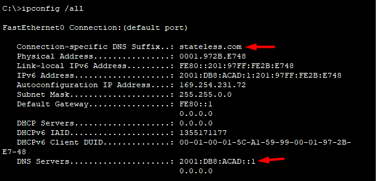

# Configure DHCPv4/DHCPv6
 
[DHCPv4](#implement-dhcpv4)  
[DHCPv6](#configure-dhcpv6)

# Implement DHCPv4
 Топология сети для данной работы:


Таблица адресов:


Objectives
- [Part 1: Build the Network and Configure Basic Device Settings](#part-1-build-the-network-and-configure-basic-device-settings)
    - [Step 1: Establish an addressing scheme](#step-1-establish-an-addressing-scheme)
    - [Step 4: Configure Inter-VLAN Routing on R1](#step-4-configure-inter-vlan-routing-on-r1)
    - [Step 5: Configure e0/1 on R2, then e0/0 and static routing for both routers](#step-5-configure-e01-on-r2-then-e00-and-static-routing-for-both-routers)
    - [Step 7: Create VLANs on S1](#step-7-create-vlans-on-s1)
    - [Step 8: Assign VLANs to the correct switch interfaces](#step-8-assign-vlans-to-the-correct-switch-interfaces)
    - [Step 9: Manually configure S1’s interface e0/1 as an 802.1Q trunk](#step-9-manually-configure-s1s-interface-e01-as-an-8021q-trunk)
- [Part 2: Configure and verify two DHCPv4 Servers on R1](#part-2-configure-and-verify-two-dhcpv4-servers-on-r1)
    - [Step 1: Configure R1 with DHCPv4 pools for the two supported subnets. Only the DHCP Pool for subnet A is given below](#step-1-configure-r1-with-dhcpv4-pools-for-the-two-supported-subnets-only-the-dhcp-pool-for-subnet-a-is-given-below)
    - [Step 3: Verify the DHCPv4 Server configuration](#step-3-verify-the-dhcpv4-server-configuration)
    - [Step 4: Attempt to acquire an IP address from DHCP on PC-A](#step-4-attempt-to-acquire-an-ip-address-from-dhcp-on-pc-a)
- [Part 3: Configure and verify a DHCP Relay on R2](#part-3-configure-and-verify-a-dhcp-relay-on-r2)
    - [Step 1: Configure R2 as a DHCP relay agent for the LAN on e0/1](#step-1-configure-r2-as-a-dhcp-relay-agent-for-the-lan-on-e01)
    - [Step 2: Attempt to acquire an IP address from DHCP on PC-B](#step-2-attempt-to-acquire-an-ip-address-from-dhcp-on-pc-b)


## Part 1: Build the Network and Configure Basic Device Settings

### Step 1: Establish an addressing scheme
---
В ходе данного шага подсеть 192.168.1.0/24 разбита на подсети:  
- Subnet A -> 192.168.1.0-63 /26
- Subnet B -> 192.168.1.64-95 /27
- Subnet C -> 192.168.1.96-111 /28

Адреса интерфейсов из этих подсетей можно увидеть в [таблице адресов](#implement-dhcpv4). 

### Step 4: Configure Inter-VLAN Routing on R1
---
Команды, введённые на данном этапе:  
```
R1(config)#int e0/1
R1(config-if)#no shutdown
R1(config-if)#ex
R1(config)
R1(config)
R1(config)
R1(config)#int e0/1.100
R1(config-subif)#encapsulation dot1Q 100
R1(config-subif)#ip address 192.168.1.1 255.255.255.192
R1(config-subif)#description Clients
R1(config-if)#ex
R1(config)
R1(config)
R1(config)
R1(config)#int e0/1.200
R1(config-subif)#encapsulation dot 200
R1(config-subif)#ip address 192.168.1.65 255.255.255.224
R1(config-subif)#description Management
R1(config-if)#ex
R1(config)
R1(config)
R1(config)
R1(config)#int e0/1.1000
R1(config-subif)#encapsulation dot1Q 1000 native
R1(config-subif)#description Native
R1(config-if)#ex
R1(config)
```

Проверка интерфейсов:  
```
R1#sh int description
Interface                      Status         Protocol Description
Et0/0                          admin down     down
Et0/1                          up             up
Et0/1.100                      up             up       Clients
Et0/1.200                      up             up       Management
Et0/1.1000                     up             up       Native
Et0/2                          admin down     down
Et0/3                          admin down     down
```

### Step 5: Configure e0/1 on R2, then e0/0 and static routing for both routers
---

Команды, введённые на данном этапе:  

Для R1  
```
R1(config)#int e0/0
R1(config-if)#no shutdown
R1(config-if)#ip addr 10.0.0.1 255.255.255.252
R1(config-if)#ex
R1(config)
R1(config)
R1(config)
R1(config)#ip route 0.0.0.0 0.0.0.0 10.0.0.2
```

Для R2  
```
R2(config)#int e0/0
R2(config-if)#no shutdown
R2(config-if)#ip addr 10.0.0.2 255.255.255.252
R2(config-if)#ex
R2(config)
R2(config)
R2(config)
R2(config)#int e0/1
R2(config-if)#no shutdown
R2(config-if)#ip addr 192.168.1.97 255.255.255.240
R2(config-if)#ex
R2(config)
R2(config)
R2(config)
R2(config)#ip route 0.0.0.0 0.0.0.0 10.0.0.1
```

Проверка работоспособности:  
```
R1#ping 192.168.1.97
Type escape sequence to abort.
Sending 5, 100-byte ICMP Echos to 192.168.1.97, timeout is 2 seconds:
!!!!!
Success rate is 100 percent (5/5), round-trip min/avg/max = 1/1/1 ms
```

### Step 7: Create VLANs on S1.  
---

Команды, введённые на данном этапе:  

Для S1  
```
S1(config)#vlan 100
S1(config-vlan)#name Clients
S1(config-vlan)#vlan 200
S1(config-vlan)#name Management
S1(config-vlan)#vlan 999
S1(config-vlan)#name Parking_lot
S1(config-vlan)#vlan 1000
S1(config-vlan)#name Native
S1(config)#exit
S1(config)#
S1(config)#
S1(config)#
S1(config)#int vlan 200
S1(config-if)#ip addr 192.168.1.66 255.255.255.224
S1(config-if)#no shutdown
S1(config)#exit
S1(config)#
S1(config)#
S1(config)#
S1(config)#ip default-gateway 192.168.1.65
S1(config)#
S1(config)#
S1(config)#
S1(config)#int range e0/2-3
S1(config-if-range)#switchport mode access
S1(config-if-range)#switchport access vlan 999
S1(config-if-range)#shutdown
```

Для S2  
```
S2(config-if)#ip addr 192.168.1.67 255.255.255.224
S2(config-if)#no shutdown
S2(config-if)#exi
S2(config)#
S2(config)#
S2(config)#
S2(config)#ip default-gateway 192.168.1.65
S2(config)#
S2(config)#
S2(config)#
S2(config)#int range e0/2-3
S2(config-if-range)#shutdown
```

### Step 8: Assign VLANs to the correct switch interfaces.
---

Команды, введённые на данном этапе:  

Для S1  
```
S1(config)#int e0/0
S1(config-if)#switchport mode access
S1(config-if)#switchport access vlan 100
```

Для S2  
```
S2(config)#int e0/0
S2(config-if)#sw
S2(config-if)#switchport mode access
```

Проверка настроек интерфейсов:  

Для S1  
```
S1(config)#do sh vlan
VLAN Name                             Status    Ports
---- -------------------------------- --------- -------------------------------
1    default                          active    Et0/1
100  Clients                          active    Et0/0
200  Management                       active
999  Parking_lot                      active    Et0/2, Et0/3
1000 Native                           active
1002 fddi-default                     act/unsup
1003 token-ring-default               act/unsup
1004 fddinet-default                  act/unsup
1005 trnet-default                    act/unsup
```

Для S2  
```
S2(config)#do sh vlan
VLAN Name                             Status    Ports
---- -------------------------------- --------- -------------------------------
1    default                          active    Et0/0, Et0/1, Et0/2, Et0/3
1002 fddi-default                     act/unsup
1003 token-ring-default               act/unsup
1004 fddinet-default                  act/unsup
1005 trnet-default                    act/unsup
```

*A: Почему Et0/0 у S2 отображается в VLAN 1?*  
Q: Потому что по умолчанию все интерфейсы коммутатора находятся в этом VLAN.  

### Step 9: Manually configure S1’s interface e0/1 as an 802.1Q trunk.
---

Команды, введённые на данном этапе:  
```
S1(config)#int e0/1
S1(config-if)#switchport trunk encapsulation dot1q
S1(config-if)#switchport mode trunk
S1(config-if)#switchport trunk native vlan 1000
```

Проверка корректности настроек:  
```
S1#sh interfaces trunk

Port        Mode             Encapsulation  Status        Native vlan
Et0/1       on               802.1q         trunking      1000

Port        Vlans allowed on trunk
Et0/1       100,200,1000

Port        Vlans allowed and active in management domain
Et0/1       100,200,1000

Port        Vlans in spanning tree forwarding state and not pruned
Et0/1       100,200,1000
```

*A: На данный момент, какой IP-адрес будет у ПК, который подключается к сети с запросом ip от DHCP-сервера?*  
Q: адрес из диапазона 169.254.х.х, который ПК присваивает себе сам в случае если адрес ему не назначен.  

## Part 2: Configure and verify two DHCPv4 Servers on R1

### Step 1: Configure R1 with DHCPv4 pools for the two supported subnets. Only the DHCP Pool for subnet A is given below
---

Команды, введённые на данном этапе: 
```
R1(config)#ip dhcp excluded-address 192.168.1.1 192.168.1.5
R1(config)#ip dhcp excluded-address 192.168.1.97 192.168.1.102
R1(config)#
R1(config)#
R1(config)#
R1(config)#ip dhcp pool subnetA
R1(dhcp-config)#network 192.168.1.0 /26
R1(dhcp-config)#domain-name ccna-lab.com
R1(dhcp-config)#default-router 192.168.1.1
R1(dhcp-config)#lease 2 12 30
R1(dhcp-config)#exit
R1(config)#
R1(config)#
R1(config)#
R1(config)#ip dhcp pool R2_Client_LAN
R1(dhcp-config)#network 192.168.1.96 /28
R1(dhcp-config)#domain-name ccna-lab.com
R1(dhcp-config)#default-router 192.168.1.97
R1(dhcp-config)#lease 2 12 30
R1(dhcp-config)#exit
```

### Step 3: Verify the DHCPv4 Server configuration
---

Результаты работы команды *show ip dhcp pool*
```
R1(config)#do sh ip dhcp pool

Pool subnetA :
 Utilization mark (high/low)    : 100 / 0
 Subnet size (first/next)       : 0 / 0
 Total addresses                : 62
 Leased addresses               : 0
 Pending event                  : none
 1 subnet is currently in the pool :
 Current index        IP address range                    Leased addresses
 192.168.1.1          192.168.1.1      - 192.168.1.62      0

Pool R2_Client_LAN :
 Utilization mark (high/low)    : 100 / 0
 Subnet size (first/next)       : 0 / 0
 Total addresses                : 14
 Leased addresses               : 0
 Pending event                  : none
 1 subnet is currently in the pool :
 Current index        IP address range                    Leased addresses
 192.168.1.97         192.168.1.97     - 192.168.1.110     0
 ```

Результаты работы команды *show ip dhcp binding*  
```
R1(config)#do sh ip dhcp binding
Bindings from all pools not associated with VRF:
IP address          Client-ID/              Lease expiration        Type
                    Hardware address/
                    User name
```
Результаты работы команды *show ip dhcp server statistics*  
```
R1(config)#do sh ip dhcp server statistics
Memory usage         41553
Address pools        2
Database agents      0
Automatic bindings   0
Manual bindings      0
Expired bindings     0
Malformed messages   0
Secure arp entries   0

Message              Received
BOOTREQUEST          0
DHCPDISCOVER         0
DHCPREQUEST          0
DHCPDECLINE          0
DHCPRELEASE          0
DHCPINFORM           0

Message              Sent
BOOTREPLY            0
DHCPOFFER            0
DHCPACK              0
DHCPNAK              0
```

### Step 4: Attempt to acquire an IP address from DHCP on PC-A
---

Результаты проверки получения адреса:  
```
PC-A> dhcp
DDORA IP 192.168.1.6/26 GW 192.168.1.1

PC-A> ping 10.0.0.1
84 bytes from 10.0.0.1 icmp_seq=1 ttl=255 time=0.571 ms
84 bytes from 10.0.0.1 icmp_seq=2 ttl=255 time=0.619 ms
84 bytes from 10.0.0.1 icmp_seq=3 ttl=255 time=0.579 ms
84 bytes from 10.0.0.1 icmp_seq=4 ttl=255 time=0.631 ms
84 bytes from 10.0.0.1 icmp_seq=5 ttl=255 time=0.621 ms
```

## Part 3: Configure and verify a DHCP Relay on R2

### Step 1: Configure R2 as a DHCP relay agent for the LAN on e0/1
---
Команды, введённые на данном этапе:  
``` 
R2(config)#int e0/1
R2(config-if)#ip helper-address 10.0.0.1
```

### Step 2: Attempt to acquire an IP address from DHCP on PC-B
---
Результаты проверки получения адреса:  
```
PC-B> ping 192.168.1.97
84 bytes from 192.168.1.97 icmp_seq=1 ttl=255 time=0.380 ms
84 bytes from 192.168.1.97 icmp_seq=2 ttl=255 time=0.540 ms
84 bytes from 192.168.1.97 icmp_seq=3 ttl=255 time=0.613 ms
84 bytes from 192.168.1.97 icmp_seq=4 ttl=255 time=0.639 ms
84 bytes from 192.168.1.97 icmp_seq=5 ttl=255 time=0.623 ms
```

# Configure DHCPv6
 Топология сети для данной работы:  


Таблица адресов:  


Objectives
- [Part 1: Build the Network and Configure Basic Device Settings](#part-1-build-the-network-and-configure-basic-device-settings-1)
    - [Step 4: Configure interfaces and routing for both routers](#step-4-configure-interfaces-and-routing-for-both-routers)
- [Part 2: Verify SLAAC address assignment from R1](#part-2-verify-slaac-address-assignment-from-r1)
- [Part 3: Configure and verify a Stateless DHCPv6 Server on R1](#part-3-configure-and-verify-a-dhcpv6-server-on-r1)
    - [Step 1: Examine the configuration of PC-A in more detail](#step-1-examine-the-configuration-of-pc-a-in-more-detail)
    - [Step 2: Configure R1 to provide stateless DHCPv6 for PC-A](#step-2-configure-r1-to-provide-stateless-dhcpv6-for-pc-a)
- [Part 4: Configure and verify a Stateful DHCPv6 Server on R1](#part-4-configure-a-stateful-dhcpv6-server-on-r1)
- [Part 5: Configure and verify a DHCPv6 Relay on R2](#part-5-configure-and-verify-dhcpv6-relay-on-r2)
    - [Step 1: Power on PC-B and examine the SLAAC address that it generates](#step-1-power-on-pc-b-and-examine-the-slaac-address-that-it-generates)
    - [Step 2: Configure R2 as a DHCP relay agent for the LAN on e0/1](#step-2-configure-r2-as-a-dhcp-relay-agent-for-the-lan-on)
    - [Step 3: Attempt to acquire an IPv6 address from DHCPv6 on PC-B](#step-3-attempt-to-acquire-an-ipv6-address-from-dhcpv6-on-pc-b)

## Part 1: Build the Network and Configure Basic Device Settings

### Step 4: Configure interfaces and routing for both routers
---

Команды, введённые на данном этапе:  

Для R1  
```
R1(config)#int gi0/0/0
R1(config-if)#ipv6 address 2001:db8:acad:2::1/64
R1(config-if)#ipv6 address fe80::1 link-local
R1(config-if)#no shutdown 
R1(config-if)#exit
R1(config)#
R1(config)#
R1(config)#
R1(config)#int gi0/0/1
R1(config-if)#ipv6 address 2001:db8:acad:1::1/64
R1(config-if)#ipv6 address fe80::1 link-local
R1(config-if)#no shutdown 
R1(config-if)#exit
R1(config)#
R1(config)#
R1(config)#
R1(config)#ipv6 route ::/0 2001:db8:acad:2::2
```

Для R2  
```
R2(config)#int gi0/0/0
R2(config-if)#ipv6 address 2001:db8:acad:2::2/64
R2(config-if)#ipv6 address fe80::2 link-local
R2(config-if)#no shutdown
R2(config-if)#exit
R2(config)#
R2(config)#
R2(config)#
R2(config)#int gi0/0/1
R2(config-if)#ipv6 address 2001:db8:acad:3::1/64
R2(config-if)#ipv6 address fe80::1 link-local
R2(config-if)#no shutdown
R2(config-if)#exit
R2(config)#
R2(config)#
R2(config)#
R2(config)#ipv6 route ::/0 2001:db8:acad:2::1
```

Результаты проверки:  
```
R1#ping ipv6 2001:db8:acad:3::1
Type escape sequence to abort.
Sending 5, 100-byte ICMP Echos to 2001:db8:acad:3::1, timeout is 2 seconds:
!!!!!
Success rate is 100 percent (5/5), round-trip min/avg/max = 0/0/2 ms
```

## Part 2: Verify SLAAC Address Assignment from R1

Команды, введённые на данном этапе:  

Для R1  
```
R1(config)#ipv6 unicast-routing
```

Для R2  
```
R2(config)#ipv6 unicast-routing
```

Результаты проверки:  


*A: Откуда взялась часть с идентификатором хоста?*  
Q: Была сгенерирована из mac-адреса (0001.972B.E748) с помощью механизма EUI-64 (201:97 **FF:FE** 2B:E748).

## Part 3: Configure and Verify a DHCPv6 server on R1

### Step 1: Examine the configuration of PC-A in more detail
---

Подробная конфигурация PC-A:  


### Step 2: Configure R1 to provide stateless DHCPv6 for PC-A
---

Команды, введённые на данном этапе: 
```
R1(config)#ipv6 dhcp pool R1-STATELESS
R1(config-dhcpv6)#dns-server 2001:db8:acad::1
R1(config-dhcpv6)#domain-name stateless.com
R1(config-dhcpv6)#exit
R1(config)#
R1(config)#
R1(config)#
R1(config)#int gi0/0/1
R1(config-if)#ipv6 nd other-config-flag 
R1(config-if)#ipv6 dhcp server R1-STATELESS
R1(config-if)#exit
```

Проверка конфигурации PC-A:  



Результат проверки соединения:  
```
C:\>ping 2001:db8:acad:3::1

Pinging 2001:db8:acad:3::1 with 32 bytes of data:

Reply from 2001:DB8:ACAD:3::1: bytes=32 time<1ms TTL=254
Reply from 2001:DB8:ACAD:3::1: bytes=32 time<1ms TTL=254
Reply from 2001:DB8:ACAD:3::1: bytes=32 time<1ms TTL=254
Reply from 2001:DB8:ACAD:3::1: bytes=32 time<1ms TTL=254

Ping statistics for 2001:DB8:ACAD:3::1:
    Packets: Sent = 4, Received = 4, Lost = 0 (0% loss),
Approximate round trip times in milli-seconds:
    Minimum = 0ms, Maximum = 0ms, Average = 0ms
```

## Part 4: Configure a stateful DHCPv6 server on R1

Команды, введённые на данном этапе:  
```
R1(config)#ipv6 dhcp pool R2-STATEFUL
R1(config-dhcpv6)#address prefix 2001:db8:acad:3:aaa::/80
R1(config-dhcpv6)#dns-server 2001:db8:acad::254
R1(config-dhcpv6)#domain-name stateful.com
R1(config-dhcpv6)#exit
R1(config)#
R1(config)#
R1(config)#
R1(config)#int gi0/0/0
R1(config-if)#ipv6 dhcp server R2-STATEFUL
R1(config-if)#exit
```

## Part 5: Configure and verify DHCPv6 relay on R2

### Step 1: Power on PC-B and examine the SLAAC address that it generates
---

Конфигурация PC-B при старте:  


### Step 2: Configure R2 as a DHCP relay agent for the LAN on e0/1
---

Команды, введённые на данном этапе:  
```
R2(config)#int e0/1
R2(config-if)ipv6 nd managed-config-flag
R2(config-if)#ipv6 dhcp relay destination 2001:DB8:ACAD:2::1 e0/0
R2(config-if)exit
```

### Step 3: Attempt to acquire an IPv6 address from DHCPv6 on PC-B
---

Результаты проверки выдачи адреса PC-B и проверка соединения:  

