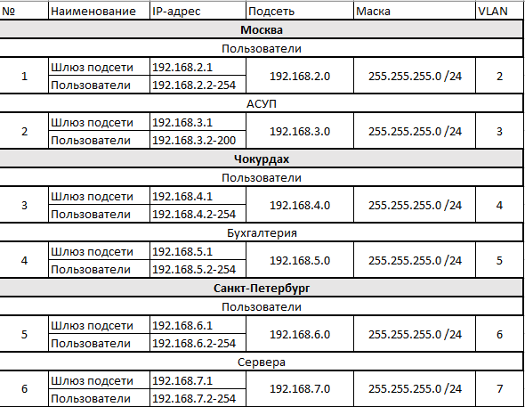
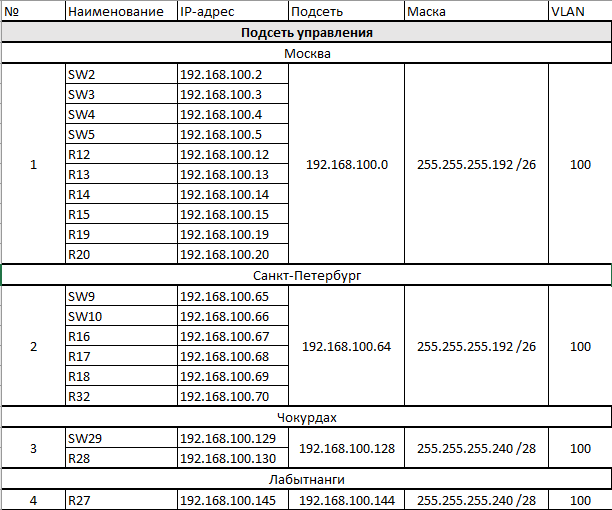
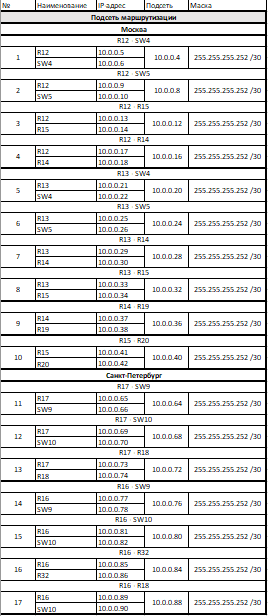
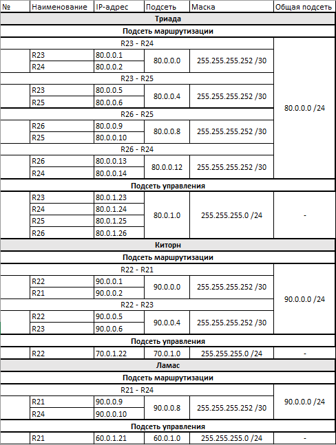
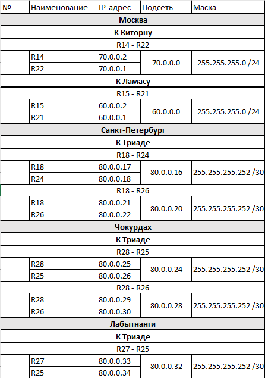
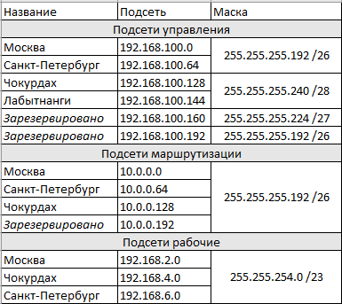
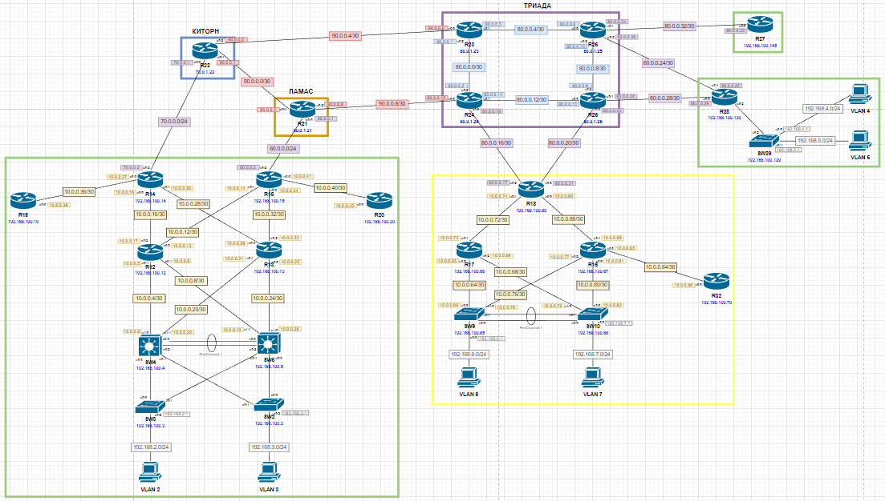
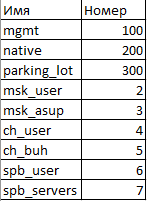

# Проектирование сети
 Топология сети для данной работы:  

  

Оригиналы схемы сети и таблиц ip-адресации представлены [тут](./Schemes/).

Цели
- [Разработка и документирование адресного пространства для лабораторного стенда](#разработка-и-документирование-адресного-пространства-для-лабораторного-стенда)
- [Настройка ip-адресов на каждом активном порту](#настройка-ip-адресов-на-каждом-активном-порту)
- [Настройка VPC в каждом офисе в своем VLAN](#настройка-vpc-в-каждом-офисе-в-своем-vlan)
- [Настройка VLAN/Loopback interface управления для сетевых устройств](#настройка-vlanloopback-interface-управления-для-сетевых-устройств)
- [Настройка сетей офисов так, чтобы не возникало broadcast штормов, и чтобы использование линков было максимально оптимизировано](#настройка-сетей-офисов-так-чтобы-не-возникало-broadcast-штормов-и-чтобы-использование-линков-было-максимально-оптимизировано)

## Разработка и документирование адресного пространства для лабораторного стенда

Для лабораторного стенда необходимо, по сути, определиться с пятью адресными пространствами:
- подсетями для пользователей (далее рабочими подсетями);
- подсетью управления сетевыми устройствами;
- подсетью для маршрутизации между сетевыми устройствами;
- подсетями провайдеров (включают все три пункта выше, но только для провайдерских подсетей);
- каналами выхода из LAN к ISP.  

Кроме того, необходимо в ходе разделения на подсети предусмотреть возможность суммаризации подсетей.  

С учётом данных требований были распределены следующие адресные пространства:
- подсети для пользователей  

  

- подсеть управления сетевыми устройствами  

  

- подсеть для маршрутизации между сетевыми устройствами  

  

- подсети провайдеров  

  

- каналы выхода к ISP  

  

Эти подсети можно суммаризировать следующим образом:  
  

## Настройка ip-адресов на каждом активном порту

Для каждого активного порта маршрутизатора был настроен адрес согласно разработанным ранее адресным пространствам. Результаты настроек представлены на схеме:  

  

## Настройка VPC в каждом офисе в своем VLAN

Для лабораторного стенда были выделены следующие VLAN:  

  

И в таблице представлены VLAN для VPC (ip-адреса для них распределяются DHCP-сервером). Наглядно распределение по VLAN видно на [схеме из пункта выше](#настройка-ip-адресов-на-каждом-активном-порту).

## Настройка VLAN/Loopback interface управления для сетевых устройств

Всем сетевые устройствам были настроены управляющие интерфейсы согласно согласно разработанным ранее адресным пространствам. Наглядно распределение интерфейсов видно на [схеме из пункта выше](#настройка-ip-адресов-на-каждом-активном-порту) (синим цветом под названием устройства).  

## Настройка сетей офисов так, чтобы не возникало broadcast штормов, и чтобы использование линков было максимально оптимизировано

Для оптимального использования линков на коммутаторах были (где возможно) настроены агрегация каналов, STP (с настройкой высокого приоритета агрегированных портов) и VTP v3. Все порты коммутаторов настроены в свои VLAN, а неиспользуемые - в специальный VLAN, а так же выключены. Кроме того, для отказоустойчивости планируется настройка GLBP (но это будет делаться параллельно с настройкой динамической маршрутизации для более корректной настройки).  
На данный момент решено не изменять количество линков между устройсвами, так как на текущем этапе не совсем ясно видно, что именно можно изменить для улучшения.