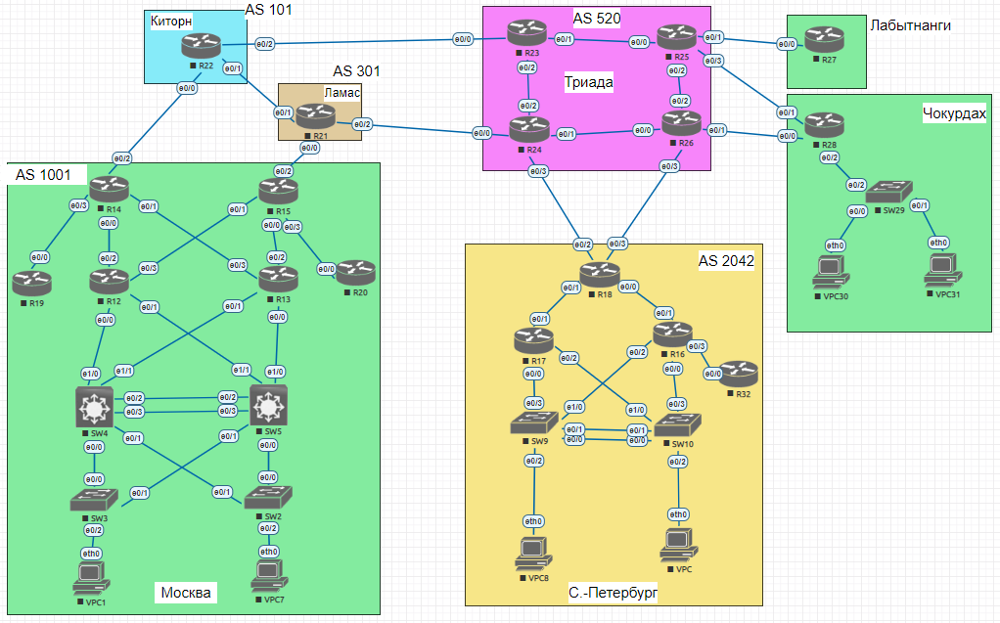

# Проектирование сети
 Топология сети для данной работы:

Таблица адресов:

Цели
- [Разработка и документирование адресного пространства для лабораторного стенда](#разработка-и-документирование-адресного-пространства-для-лабораторного-стенда)
- [Настрока ip-адресов на каждом активном порту]()
- [Настройка VPC в каждом офисе в своем VLAN]()
- [Настройка VLAN/Loopback interface управления для сетевых устройств]()
- [Настройка сетей офисов так, чтобы не возникало broadcast штормов, и чтобы использование линков было максимально оптимизировано]()

## Разработка и документирование адресного пространства для лабораторного стенда

Для 
