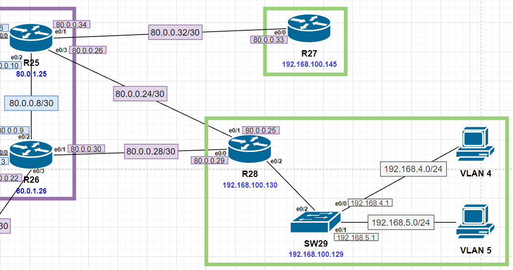
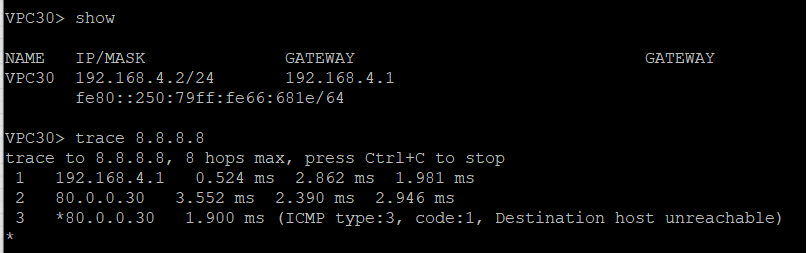
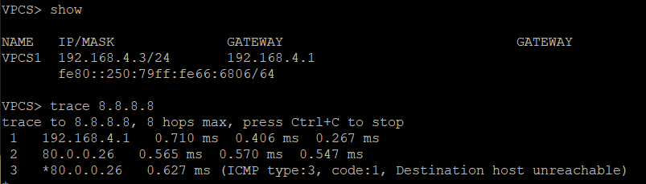
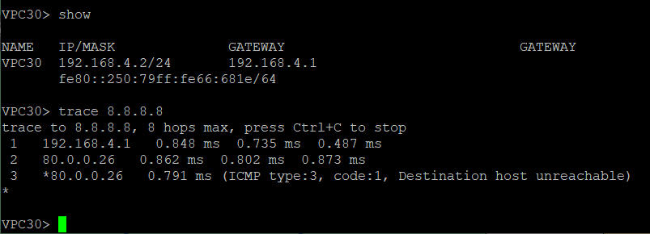

# Маршрутизация на основе политик (PBR)

Cхемы сети и таблиц ip-адресации представлены [тут](https://github.com/DemonOfLaziness/otus-labs/tree/main/labs/lab10/Schemes).  

Фрагмент общей схемы, на котором будут проводиться работы:  
  

Цели

- [Настройка отслеживания линка через технологию IP SLA](#настройка-отслеживания-линка-через-технологию-ip-sla)
- [Распределение трафика между двумя линками с провайдером](#распределение-трафика-между-двумя-линками-с-провайдером)
- [Настройка для офиса Лабытнанги маршрута по умолчанию](#настройка-для-офиса-лабытнанги-маршрута-по-умолчанию)

## Настройка отслеживания линка через технологию IP SLA

Первоначально для выхода за пределы локальной сети нужно настроить маршрут по умолчанию и предусмотреть возможность резервирования маршрута на случай обрыва связи с провайдером. Так как в офисе два линка до ISP, остаётся только настроить роутер для отслеживания состояния канала и своевременного переключения на резервный, для чего ,будет использована технология IP SLA.  

Настройка пройдёт в 3 этапа - создание IP SLA (проверки), track (отслеживателя) для отслеживания состояния результатов проверки и создание маршрутов по умолчанию с прикрепленными к ним отслеживателями состояния линка к провайдеру (IP SLA просто проводит проверки, а на результаты проверок реагирует track, и только его состояния можно привязать к тем же маршрутам, например, напрямую связать состояния IP SLA с каким-либо действием (сменой маршрута по умолчанию или проверкой условия доступности next-hop в route-map) нельзя).  

Сначала нужно создать две проверки - по одной на каждый линк (№1 - для линка *R28<->R25* и №2 для линка *R28<->R26*):  

```
R28(config)#
R28(config)#ip sla 1
R28(config-ip-sla)#icmp-echo 80.0.0.26 source-ip 80.0.0.25
R28(config-ip-sla-echo)#frequency 10
R28(config)#
R28(config)#
R28(config)#ip sla 2
R28(config-ip-sla)#icmp-echo 80.0.0.30 source-ip 80.0.0.29
R28(config-ip-sla-echo)#frequency 10
R28(config)#
R28(config)#
R28(config)#ip sla schedule 1 life forever start-time now
R28(config)#ip sla schedule 2 life forever start-time now
```   

IP-адрес, с которого отправляются ICMP-запросы, указан явным образом для того, чтобы проверка шла именно по линку между роутерами и ICMP-пакет не ушёл по другому каналу провайдера.  

После создания и запуска IP SLA нужно создать два track - по одному на каждый линк (№1 - для линка *R28<->R25* и №2 для линка *R28<->R26*):  

```
R28(config)#track 1 ip sla 1
R28(config-track)#delay down 30 up 15
R28(config-track)#exit
R28(config)#
R28(config)#
R28(config)#track 2 ip sla 2
R28(config-track)#delay down 30 up 15
```  

Проверка состояния настроенных IP SLA и track:  

```
R28#sh ip sla summary
IPSLAs Latest Operation Summary
Codes: * active, ^ inactive, ~ pending

ID           Type        Destination       Stats       Return      Last
                                           (ms)        Code        Run
-----------------------------------------------------------------------
*1           icmp-echo   80.0.0.26         -           OK          12 seconds ago
*2           icmp-echo   80.0.0.30         -           OK          8 seconds ago
R28#
R28#
R28#
R28#sh track brief
Track   Object                           Parameter        Value Last Change
1       ip sla      1                    state            Up    00:44:12
2       ip sla      2                    state            Up    00:44:12
```  

После этого необходимо привязать состояния линков к маршрутам по умолчанию так, чтобы в случае падения линка основного маршрута автоматически "включался" запасной:  

```
R28(config)#ip route 0.0.0.0 0.0.0.0 80.0.0.30 50 track 2
R28(config)#ip route 0.0.0.0 0.0.0.0 80.0.0.26 100 track 1
```  

## Распределение трафика между двумя линками с провайдером

Для распределения трафика будет использована маршрутизация на основе политик. Так как для раздачи ip пользователям настроен DHCP-сервер и не предполагается каких-то серьёзных специфических нагрузок на сеть, можно распределить трафик просто направив все запросы от пользователей с чётными ip-адресами по одному каналу, а c нечётных - по другому (потому что в теории и тех и других будет примерно одинаковое количество, так как DHCP-сервер раздаёт ip-адреса подряд и срок их аренды небольшой).  

Для маршрутизации на основе политик необходимо настроить route-map. Но перед этим нужно создать ACL для того, чтобы они "отсеивали" чётные и нечётные ip-адреса для route-map. Кроме того, из PBR нужно исключить внутренние подсети, для чего тоже нужен свой ACL.  

Созданные ACL:  
```
R28#sh access-lists
Extended IP access list even_ip
    10 permit ip 192.168.0.0 0.0.255.254 any
Extended IP access list odd_ip
    10 permit ip 192.168.0.0 0.0.255.255 any
Extended IP access list internal_ip
    10 permit ip any 192.168.4.0 0.0.1.255
    20 permit ip any 192.168.100.0 0.0.0.15
```  

После ACL можно настраивать уже саму route-map. В нём будет три политики. первая - для внутренних подсетей, они будут сразу отправляться на стандартную маршрутизацию. Вторая - для чётных ip-адресов, они будут отправляться на линк *R28<->R26*, если он работает, иначе на запасной. Третья - для нечётных ip-адресов, они будут отправляться на линк *R28<->R25*, если он работает, иначе на запасной.  

Созданная route-map:  
```
R28#sh route-map balancing_map
route-map balancing_map, deny, sequence 5
  Match clauses:
    ip address (access-lists): internal_ip
  Set clauses:
  Policy routing matches: 0 packets, 0 bytes
route-map balancing_map, permit, sequence 10
  Match clauses:
    ip address (access-lists): even_ip
  Set clauses:
    ip next-hop verify-availability 80.0.0.30 1 track 2  [up]
    ip next-hop verify-availability 80.0.0.26 2 track 1  [up]
  Policy routing matches: 0 packets, 0 bytes
route-map balancing_map, permit, sequence 20
  Match clauses:
    ip address (access-lists): odd_ip
  Set clauses:
    ip next-hop verify-availability 80.0.0.26 1 track 1  [up]
    ip next-hop verify-availability 80.0.0.30 2 track 2  [up]
  Policy routing matches: 0 packets, 0 bytes
```  

Теперь route-map необходимо привязать к интерфейсам, на которые будет приходить трафик и где будет определяться дальнейший путь пришедших пакетов.  

Привязка route-map к интерфейсам:  

```
R28(config)#interface e0/2.4
R28(config-subif)#ip policy route-map balancing_map
R28(config-subif)#exit
R28(config)#
R28(config)#
R28(config)#interface e0/2.5
R28(config-subif)#ip policy route-map balancing_map
R28(config-subif)#exit
```  

Теперь для чётных и нечётных ip-адресов будет свой путь, обращение к внутренним ip-адресам политиками управляться не будет.  

Для проверки был добавлен ещё один ПК в подсеть ch_user (192.168.4.0/24) и с двух компьютеров была проведена трассировка маршрута для проверки next-hops, которые проходят пакеты на пути в Интернет.  

Трассировка чётного ip-адреса:  
  

Трассировка нечётного ip-адреса:  
  

Кроме того, была проверена ситуация обрыва линка, который является основным для маршрутизации данного ip-адреса. В этом случае сеть на некоторое время пропадает, после чего идёт отправка пакетов по второму маршруту:   
  

После восстановления связи на первом канале маршрутизация принимает изначальный вид.  

## Настройка для офиса Лабытнанги маршрута по умолчанию

Для R27, маршрутизатора офиса Лабытнанги, был прописан маршрут по умолчанию. так как тут единственный линк, то просто прописан статический маршрут:  
```
ip route 0.0.0.0 0.0.0.0 80.0.0.34
```