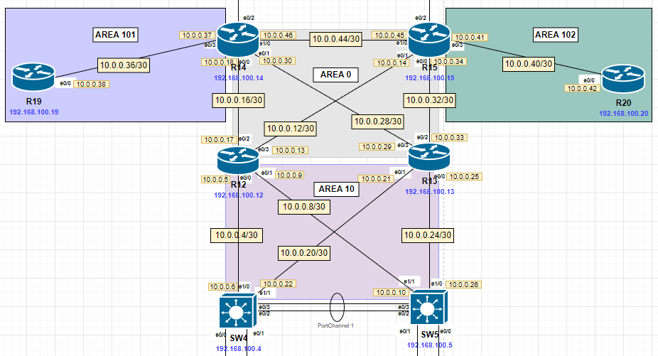

# OSPF

Актуальные схемы сети и таблиц ip-адресации представлены [тут](https://github.com/DemonOfLaziness/otus-labs/tree/main/labs/lab12/Schemes).  
Файл лабораторной и основные конфиги представлены [тут](https://github.com/DemonOfLaziness/otus-labs/tree/main/labs/lab12/Configs).  

Фрагмент общей схемы, на котором будут проводиться работы:  
  

Цели

- [Маршрутизаторы R14-R15 находятся в зоне 0 - backbone](#маршрутизаторы-r14-r15-находятся-в-зоне-0---backbone)
- [Маршрутизаторы R12-R13 находятся в зоне 10. Дополнительно к маршрутам должны получать маршрут по умолчанию](#маршрутизаторы-r12-r13-находятся-в-зоне-10-дополнительно-к-маршрутам-должны-получать-маршрут-по-умолчанию)
- [Маршрутизатор R19 находится в зоне 101 и получает только маршрут по умолчанию](#маршрутизатор-r19-находится-в-зоне-101-и-получает-только-маршрут-по-умолчанию)
- [Маршрутизатор R20 находится в зоне 102 и получает все маршруты, кроме маршрутов до сетей зоны 101](#маршрутизатор-r20-находится-в-зоне-102-и-получает-все-маршруты-кроме-маршрутов-до-сетей-зоны-101)

## Маршрутизаторы R14-R15 находятся в зоне 0 - backbone

Настройку OSPF надо начать с backbone. Решено было R14-15 сделать ABR, но не для всех зон (конкретно для AREA 101 и 102), поэтому в AREA 0 попали уже имеющиеся активные интерфейсы e0/0 и e0/1 обоих маршрутизаторов. Кроме того, решено было добавить дополнительный линк напрямую между R14 и R15 (во-первых, для обмена информацией напрямую, а не через второй маршрутизатор (не только для скорости, но и для повышения отказоустойчивости), и во-вторых, на будущее, так как эти роутеры - пограничные с провайдером, и для упрощения распределения трафика и настройки второго протокола дин. маршрутизации, маршрутизаторам нужна прямая связь). Этот линк тоже попадает в AREA 0.  

OSPF был настроен в следующем порядке - сначала включен сам протокол, затем настроен router-id (совпадает с адресом для управления), затем задан диапазон ip-адресов подсети управления 192.168.100.x/26 (для активации на L3-интерфейсах, попадающих в этот диапазон, OSPF), а потом на каждом линке, входящем в AREA 0, настроен анонс его подсети.  

Настройка на R14:  
```
R14(config)#router ospf 1
R14(config-router)#router-id 192.168.100.14
R14(config-router)#network 192.168.100.0 0.0.0.63 area 0
R14(config-router)#exit
R14(config)#
R14(config)#
R14(config)#interface range e0/0-1
R14(config-if-range)#ip ospf 1 area 0
```  

Настройка на R15 - аналогичная.  
После настройки на R15 установилось соседство:  
```
R14(config-if-range)#
*Aug 13 10:29:59.993: %OSPF-5-ADJCHG: Process 1, Nbr 192.168.100.15 on Ethernet1/0 from LOADING to FULL, Loading Done
```  

## Маршрутизаторы R12-R13 находятся в зоне 10. Дополнительно к маршрутам должны получать маршрут по умолчанию

Маршрутизаторы R12-R13 будут ABR для AREA 10 (потому что R14-15 уже ABR для двух зон, плюс они будут ASBR для маршрутов с провайдера, поэтому решено было "разгрузить" их). Поэтому интерфейсы e0/2-3 будут в AREA 0, а e0/0-1 - в AREA 10.  

Сначала нужно настроить OSPF в целом, потом настроить получение маршрута по умолчанию.  

Первоначальная настройка R12 (настройка R13 аналогична):  
```
R12(config)#router ospf 1
R12(config-router)#router-id 192.168.100.12
R12(config-router)#network 192.168.100.0 0.0.0.63 area 10
R12(config-router)#exit
R12(config)#
R12(config)#
R12(config)#int range e0/2-3
R12(config-if-range)#ip ospf area 0
R12(config-if-range)#exit
R12(config)#
R12(config)#
R12(config)#int range e0/0-1
R12(config-if-range)#ip ospf area 10
R12(config-if-range)#exit
```  

Помимо маршрутизаторов в AREA 10 были добавлены SW4-5 (для нормального доступа к подсети пользователей 192.168.2.0/23). Так как на них есть L3-интерфейсы, которые предназначены только для пользовательских подсетей, где находятся только L2-коммутаторы и оконечное оборудование, то на SW4-5 нужно было запретить слать апдейты OSPF через такие интерфейсы. Так как, чисто технически, на коммутаторах новые интерфейсы скорее будут для пользовательских подсетей, чем для сообщения с уровнем ядра, то правильнее отключить апдейты для всех интерфейсов по умолчанию, и включать только на нужных (идущих к уровню ядра - e1/0 и e1/1).  

Настройка на SW4 (SW5 - аналогично):  
```
SW4(config)#router ospf 1
SW4(config-router)#router-id 192.168.100.4
SW4(config-router)#network 192.168.100.0 0.0.0.63 area 10
SW4(config-router)#network 192.168.2.0 0.0.1.255 area 10
SW4(config-router)#passive-interface default
SW4(config-router)#no passive-interface e1/0
SW4(config-router)#no passive-interface e1/1
SW4(config-router)#exit
SW4(config)#
SW4(config)#
SW4(config)#int range e1/0-1
SW4(config-if-range)#ip ospf area 10
SW4(config-if-range)#exit
```  

В процессе проверки связности было обнаружено, что интерфейсы Vlan100 с подсетью 192.168.100.0/26 SW4-5 не пингуются и их ip не появляются в ip route соседей по OSPF, в отличии от ip Loopback-интерфейсов маршрутизаторов. Пришлось ~~сделать финт ушами~~ поменять маску подсети с /26 на /29 (куда входят Vlan-интерфейсы всех коммутаторов уровня доступа и уровня распределения в данном офисе), после чего подсеть 192.168.100.0/29 стала известна всем устройствам и коммутаторы начали пинговаться.  

Настройка получения маршрута по умолчанию для AREA 10 была выполнена с помощью оригинирования маршрута по умолчанию на R15 и R14 (потому что в итоге эти два маршрутизатора действительно будут объявлять маршрут по умолчанию для выхода в Интернет).  

Процесс настройки на R15 (на R14 настройка была аналогичной):  
```
R15(config)#router ospf 1
R15(config-router)#default-information originate
```  

После этого для проверки работоспособности настроенной конфигурации были объявлены на маршрутизатораз R14-15 маршруты по умолчанию (R14 - ip route 0.0.0.0 0.0.0.0 44.44.44.45, на R15 - ip route 0.0.0.0 0.0.0.0 33.33.33.34), после чего проверены таблицы маршрутизации на SW4.  

Таблица маршрутизации до:  
```
SW4#sh ip rou
...
Gateway of last resort is not set

      10.0.0.0/8 is variably subnetted, 13 subnets, 2 masks
C        10.0.0.4/30 is directly connected, Ethernet1/0
L        10.0.0.6/32 is directly connected, Ethernet1/0
...
SW4#
```  

Таблица маршрутизации после:  
```
SW4#sh ip rou
...
O*E2  0.0.0.0/0 [110/1] via 10.0.0.21, 01:16:51, Ethernet1/1
                [110/1] via 10.0.0.5, 03:47:35, Ethernet1/0
      10.0.0.0/8 is variably subnetted, 13 subnets, 2 masks
C        10.0.0.4/30 is directly connected, Ethernet1/0
L        10.0.0.6/32 is directly connected, Ethernet1/0
...
SW4#
```  

## Маршрутизатор R19 находится в зоне 101 и получает только маршрут по умолчанию

Для настройки OSPF с таким условием необходимо изменить тип AREA с normal на totally stub, тем самым заменяя все внешние и межзональные маршруты на межзональный маршрут по умолчанию. Для этого надо настроить тип AREA на R19 и R14 (который будет ABR для данной зоны).  

Настройки на R19:  
```
R19(config)#router ospf 1
R19(config-router)#router-id 192.168.100.19
R19(config-router)#network 192.168.100.0 0.0.0.63 area 101
R19(config-router)#area 101 stub
R19(config-router)#exit
R19(config)#
R19(config)#
R19(config)#int e0/0
R19(config-if)#ip ospf area 101
```  

Настройки на R14: 
```
R14(config)#int e0/3
R14(config-if)#ip ospf
R14(config-if)#ip ospf area 101
R14(config-if)#exit
R14(config)#
R14(config)#
R14(config)#router ospf 1
R14(config-router)#area 101 stub no-summary
```  
На каждом маршрутизаторе зона была обозначена как stub, а для настройки её в totally stub на ABR зоны (R14) зона была обозначена как totally stub дополнением команды *area 101 stub* параметром *no-summary*.  

Для проверки были просмотрены RIB и таблица маршрутизации, где действительно есть только внутренние подстеи AREA и маршрут по умолчанию.  

RIB:
```
R19#sh ip ospf rib

            OSPF Router with ID (192.168.100.19) (Process ID 1)


                Base Topology (MTID 0)

OSPF local RIB
Codes: * - Best, > - Installed in global RIB

*   10.0.0.36/30, Intra, cost 10, area 101, Connected
      via 10.0.0.38, Ethernet0/0
*   192.168.100.19/32, Intra, cost 1, area 101, Connected
      via 192.168.100.19, Loopback0
*>  0.0.0.0/0, Inter, cost 11, area 101
      via 10.0.0.37, Ethernet0/0
R19#
```  

Таблица маршрутизации:  
```
R19#sh ip rou
Codes: L - local, C - connected, S - static, R - RIP, M - mobile, B - BGP
       D - EIGRP, EX - EIGRP external, O - OSPF, IA - OSPF inter area 
       N1 - OSPF NSSA external type 1, N2 - OSPF NSSA external type 2
       E1 - OSPF external type 1, E2 - OSPF external type 2
       i - IS-IS, su - IS-IS summary, L1 - IS-IS level-1, L2 - IS-IS level-2
       ia - IS-IS inter area, * - candidate default, U - per-user static route
       o - ODR, P - periodic downloaded static route, H - NHRP, l - LISP
       + - replicated route, % - next hop override

Gateway of last resort is 10.0.0.37 to network 0.0.0.0

O*IA  0.0.0.0/0 [110/11] via 10.0.0.37, 04:47:54, Ethernet0/0
      10.0.0.0/8 is variably subnetted, 2 subnets, 2 masks
C        10.0.0.36/30 is directly connected, Ethernet0/0
L        10.0.0.38/32 is directly connected, Ethernet0/0
      192.168.100.0/24 is variably subnetted, 2 subnets, 2 masks
C        192.168.100.0/26 is directly connected, Loopback0
L        192.168.100.19/32 is directly connected, Loopback0
R19#
```  

## Маршрутизатор R20 находится в зоне 102 и получает все маршруты, кроме маршрутов до сетей зоны 101

Для выполнения данного условия на ABR AREA 102 (R15) необходимо было настроить фильтрацию маршрутов в (in) AREA 102 с помощью prefix-list (запретив передачу префиксов 10.0.0.36/30 и 192.168.100.19/32). R20 настраивается как обычно, в normal AREA, и дополнительных параметров настройки не применяется.  

Настройки R20:  
```
R20(config)#router ospf 1
R20(config-router)#router-id 192.168.100.20
R20(config-router)#network 192.168.100.0 0.0.0.63 area 102
R20(config-router)#exit
R20(config)#
R20(config)#
R20(config)#interface e0/0
R20(config-if)#ip ospf area 102
```  

Настройки R15:  
```
R15(config)#interface e0/3
R15(config-if)#ip ospf area 102
R15(config-if)#exit
R15(config)#
R15(config)#
R15(config)#ip prefix-list area_102_in deny 10.0.0.36/30
R15(config)#ip prefix-list area_102_in deny 192.168.100.19/32
R15(config)#ip prefix-list area_102_in permit 0.0.0.0/0 le 32
R15(config)#
R15(config)#
R15(config)#router ospf 1
R15(config-router)#area 102 filter-list prefix area_102_in in
```  

После этого в таблице маршрутизации пропали записи префиксов зоны 101, остальные маршруты остались на месте:  
```
Gateway of last resort is 10.0.0.41 to network 0.0.0.0

O*E2  0.0.0.0/0 [110/1] via 10.0.0.41, 00:54:35, Ethernet0/0
      10.0.0.0/8 is variably subnetted, 11 subnets, 2 masks
O IA     10.0.0.4/30 [110/30] via 10.0.0.41, 00:05:08, Ethernet0/0
O IA     10.0.0.8/30 [110/30] via 10.0.0.41, 00:05:08, Ethernet0/0
O IA     10.0.0.12/30 [110/20] via 10.0.0.41, 00:05:08, Ethernet0/0
O IA     10.0.0.16/30 [110/30] via 10.0.0.41, 00:05:08, Ethernet0/0
O IA     10.0.0.20/30 [110/30] via 10.0.0.41, 00:05:08, Ethernet0/0
O IA     10.0.0.24/30 [110/30] via 10.0.0.41, 00:05:08, Ethernet0/0
O IA     10.0.0.28/30 [110/30] via 10.0.0.41, 00:05:08, Ethernet0/0
O IA     10.0.0.32/30 [110/20] via 10.0.0.41, 00:05:08, Ethernet0/0
C        10.0.0.40/30 is directly connected, Ethernet0/0
L        10.0.0.42/32 is directly connected, Ethernet0/0
O IA     10.0.0.44/30 [110/20] via 10.0.0.41, 00:05:08, Ethernet0/0
O IA  192.168.2.0/24 [110/31] via 10.0.0.41, 00:05:08, Ethernet0/0
O IA  192.168.3.0/24 [110/31] via 10.0.0.41, 00:05:08, Ethernet0/0
      192.168.100.0/24 is variably subnetted, 6 subnets, 2 masks
C        192.168.100.0/26 is directly connected, Loopback0
O IA     192.168.100.12/32 [110/21] via 10.0.0.41, 00:05:08, Ethernet0/0
O IA     192.168.100.13/32 [110/21] via 10.0.0.41, 00:05:08, Ethernet0/0
O IA     192.168.100.14/32 [110/21] via 10.0.0.41, 00:05:08, Ethernet0/0
O IA     192.168.100.15/32 [110/11] via 10.0.0.41, 00:05:08, Ethernet0/0
L        192.168.100.20/32 is directly connected, Loopback0
```