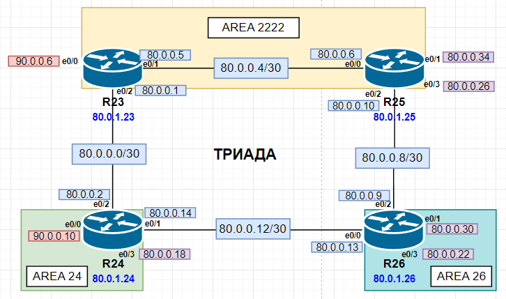

# IS-IS

Актуальные схемы сети и таблиц ip-адресации представлены [тут](https://github.com/DemonOfLaziness/otus-labs/tree/main/labs/lab13/Schemes).  
Файл лабораторной и основные конфиги представлены [тут](https://github.com/DemonOfLaziness/otus-labs/tree/main/labs/lab13/Configs).  

Фрагмент общей схемы, на котором будут проводиться работы:  
  

Цели

- [R23 и R25 находятся в зоне 2222](#r23-и-r25-находятся-в-зоне-2222)
- [R24 находится в зоне 24](#r24-находится-в-зоне-24)
- [R26 находится в зоне 26](#r26-находится-в-зоне-26)
- [Проверка настроек протокола IS-IS](#проверка-настроек-протокола-is-is)

## R23 и R25 находятся в зоне 2222

Настройка IS-IS на R23 и R25 была в следующем порядке - настроен NET (в system ID первыми цифрами будет ip-адрес управления), включена настройка *passive-interface default* (потому что, в отличии от маршрутизаторов офиса в Москве, тут больше интерфейсов в сторону "пользователей", а не соседей по IS-IS) и интерфейсы в сторону соседей были выведены в активный режим (для включения возможности обмена hello-пакетов).  

Настройка на R23 (на R25 аналогично):  
```
R23(config)#router isis
R23(config-router)#net 49.2222.80.0.1.23.00.0000.00
R23(config-router)#passive-interface default
R23(config-router)#no passive-interface e0/1
R23(config-router)#no passive-interface e0/2
R23(config-router)#exi
```  

## R24 находится в зоне 24

Настройка IS-IS на R24 была в следующем порядке - настроен NET, включена настройка *passive-interface default* и интерфейсы в сторону соседей были выведены в активный режим (для включения возможности обмена hello-пакетов).  

Настройка на R24:  
```
R24(config)#router isis
R24(config-router)#net 49.0024.80.0.1.24.00.0000.00
R24(config-router)#passive-interface default
R24(config-router)#no passive-interface e0/1
R24(config-router)#no passive-interface e0/2
R24(config-router)#exi
```  

## R26 находится в зоне 26

Настройка IS-IS на R26 была в следующем порядке - настроен NET, включена настройка *passive-interface default* и интерфейсы в сторону соседей были выведены в активный режим (для включения возможности обмена hello-пакетов).  

Настройка на R26:  
```
R26(config)#router isis
R26(config-router)#net 49.0026.80.0.1.26.00.0000.00
R26(config-router)#passive-interface default
R26(config-router)#no passive-interface e0/0
R26(config-router)#no passive-interface e0/2
R26(config-router)#exi
```  

## Проверка настроек протокола IS-IS

Проверка настроек на всех маршрутизаторах:  

R23  
```
R23#sh isis neighbors 

System Id      Type Interface   IP Address      State Holdtime Circuit Id
R24            L2   Et0/2       80.0.0.2        UP    7        R24.02             
R25            L1   Et0/1       80.0.0.6        UP    9        R25.01             
R25            L2   Et0/1       80.0.0.6        UP    7        R25.01             

R23#sh isis rib       

IPv4 local RIB for IS-IS process 

IPV4 unicast topology base (TID 0, TOPOID 0x0) =================

80.0.0.0/30
  [115/L2/20] via 80.0.0.2(Ethernet0/2), from 80.0.1.24, tag 0, LSP[3/15]
  [115/L2/30] via 80.0.0.6(Ethernet0/1), from 80.0.1.25, tag 0, LSP[8/17]

80.0.0.4/30
  [115/L1/20] via 80.0.0.6(Ethernet0/1), from 80.0.1.25, tag 0, LSP[5/14]
  [115/L2/20] via 80.0.0.6(Ethernet0/1), from 80.0.1.25, tag 0, LSP[8/17]

80.0.0.8/30
  [115/L1/20] via 80.0.0.6(Ethernet0/1), from 80.0.1.25, tag 0, LSP[5/14]
              (installed)
  [115/L2/20] via 80.0.0.6(Ethernet0/1), from 80.0.1.25, tag 0, LSP[8/17]
  [115/L2/30] via 80.0.0.2(Ethernet0/2), from 80.0.1.26, tag 0, LSP[9/11]
  [115/L2/30] via 80.0.0.6(Ethernet0/1), from 80.0.1.26, tag 0, LSP[9/11]

80.0.0.12/30
  [115/L2/20] via 80.0.0.2(Ethernet0/2), from 80.0.1.24, tag 0, LSP[3/15]
              (installed)
  [115/L2/30] via 80.0.0.2(Ethernet0/2), from 80.0.1.26, tag 0, LSP[9/11]
  [115/L2/30] via 80.0.0.6(Ethernet0/1), from 80.0.1.26, tag 0, LSP[9/11]

80.0.0.16/30
  [115/L2/10] via 80.0.0.2(Ethernet0/2), from 80.0.1.24, tag 0, LSP[3/15]
              (installed)

80.0.0.20/30
  [115/L2/20] via 80.0.0.2(Ethernet0/2), from 80.0.1.26, tag 0, LSP[9/11]
              (installed)
  [115/L2/20] via 80.0.0.6(Ethernet0/1), from 80.0.1.26, tag 0, LSP[9/11]
              (installed)

80.0.0.24/30
  [115/L1/10] via 80.0.0.6(Ethernet0/1), from 80.0.1.25, tag 0, LSP[5/14]
              (installed)
  [115/L2/10] via 80.0.0.6(Ethernet0/1), from 80.0.1.25, tag 0, LSP[8/17]

80.0.0.28/30
  [115/L2/20] via 80.0.0.2(Ethernet0/2), from 80.0.1.26, tag 0, LSP[9/11]
              (installed)
  [115/L2/20] via 80.0.0.6(Ethernet0/1), from 80.0.1.26, tag 0, LSP[9/11]
              (installed)

80.0.0.32/30
  [115/L1/10] via 80.0.0.6(Ethernet0/1), from 80.0.1.25, tag 0, LSP[5/14]
              (installed)
  [115/L2/10] via 80.0.0.6(Ethernet0/1), from 80.0.1.25, tag 0, LSP[8/17]

80.0.1.23/32
  [115/L2/30] via 80.0.0.6(Ethernet0/1), from 80.0.1.25, tag 0, LSP[8/17]

80.0.1.24/32
  [115/L2/20] via 80.0.0.2(Ethernet0/2), from 80.0.1.24, tag 0, LSP[3/15]
              (installed)

80.0.1.25/32
  [115/L1/20] via 80.0.0.6(Ethernet0/1), from 80.0.1.25, tag 0, LSP[5/14]
              (installed)
  [115/L2/20] via 80.0.0.6(Ethernet0/1), from 80.0.1.25, tag 0, LSP[8/17]

80.0.1.26/32
  [115/L2/30] via 80.0.0.2(Ethernet0/2), from 80.0.1.26, tag 0, LSP[9/11]
              (installed)
  [115/L2/30] via 80.0.0.6(Ethernet0/1), from 80.0.1.26, tag 0, LSP[9/11]
              (installed)

90.0.0.4/30
  [115/L2/20] via 80.0.0.6(Ethernet0/1), from 80.0.1.25, tag 0, LSP[8/17]

90.0.0.8/30
  [115/L2/10] via 80.0.0.2(Ethernet0/2), from 80.0.1.24, tag 0, LSP[3/15]
              (installed)
R23#
```  

Далее RIB показываться не будет, так как очень похож и уж ну очень длинный.  

R24
```
R24#sh isis neighbors 

System Id      Type Interface   IP Address      State Holdtime Circuit Id
R23            L2   Et0/2       80.0.0.1        UP    28       R24.02             
R26            L2   Et0/1       80.0.0.13       UP    9        R26.01             
R24#
```  

R25
```
R25#sh isis neighbors

System Id      Type Interface   IP Address      State Holdtime Circuit Id
R23            L1   Et0/0       80.0.0.5        UP    29       R25.01             
R23            L2   Et0/0       80.0.0.5        UP    24       R25.01             
R26            L2   Et0/2       80.0.0.9        UP    9        R26.02             
R25#
```  

R26
```
R26#sh isis neighbors

System Id      Type Interface   IP Address      State Holdtime Circuit Id
R24            L2   Et0/0       80.0.0.14       UP    28       R26.01             
R25            L2   Et0/2       80.0.0.10       UP    24       R26.02             
R26#
```  

Для проверки пропингуем с R23 интерфейс R28 (маршрутизатор в Чокурдахе), которым он связан с провайдером Триада (80.0.0.29/30).  

Результат:  
```
R23#ping 80.0.0.29
Type escape sequence to abort.
Sending 5, 100-byte ICMP Echos to 80.0.0.29, timeout is 2 seconds:
!!!!!
Success rate is 100 percent (5/5), round-trip min/avg/max = 1/1/1 ms
R23#
```  

Учитывая удачный результат пинга, можно сделать вывод, что протокол IS-IS успешно настроен.