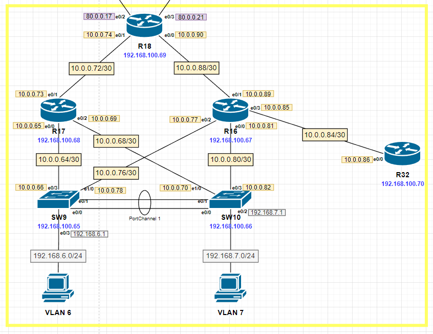

# EIGRP

Актуальные схемы сети и таблиц ip-адресации представлены [тут](https://github.com/DemonOfLaziness/otus-labs/tree/main/labs/lab14/Schemes).  
Файл лабораторной и основные конфиги представлены [тут](https://github.com/DemonOfLaziness/otus-labs/tree/main/labs/lab14/Configs).  

Фрагмент общей схемы, на котором будут проводиться работы:  
  

Ход работы

- [Предварительная настройка](#предварительная-настройка)
- [R16-17 анонсируют только суммарные префиксы](#r16-17-анонсируют-только-суммарные-префиксы)
- [R32 получает только маршрут по умолчанию](#r32-получает-только-маршрут-по-умолчанию)
- [ Проверка настроек протокола EIGRP](#проверка-настроек-протокола-eigrp)

## Предварительная настройка

Перед выполнением конкретных условий лабораторной работы необходимо предварительно сконфигурировать "базовый" EIGRP для всех устройств. Настраивать, по условиям, необходимо в EIGRP named-mode. Кроме маршрутизаторов частью EIGRP станут коммутаторы SW9-10. Router-id устройства будет совпадать с ip подсети управления. Номер AS - 13, имя - SPB.  

Настройка на R17 (остальные аналогично):  
```
R17(config)#router eigrp SPB
R17(config-router)#address-family ipv4 autonomous-system 13
R17(config-router-af)#
R17(config-router-af)#
R17(config-router-af)#network 192.168.100.64 0.0.0.63
R17(config-router-af)#network 10.0.0.64 0.0.0.63
R17(config-router-af)#
R17(config-router-af)#
R17(config-router-af)#eigrp router-id 192.168.100.68
R17(config-router-af)#no shut
```  

На SW9 и SW10 добавлены дополнительные настройки - включён passive-interface по умолчанию (потому что  на этих устройствах будут интерфейсы пользовательских сетей, а в обмене маршрутной информацией EIGRP участвуют только два интерфейса, идущих к уровню ядра).  Кроме того, включён EIGRP для интерфейсов, попадающих в диапазон 192.168.6.0/23.  

Настройка на SW9 (SW10 аналогично):  
```
SW9(config-router-af)#network 192.168.6.0 0.0.1.255
SW9(config-router-af)#
SW9(config-router-af)#
SW9(config-router-af)#af-interface default
SW9(config-router-af-interface)#passive-interface
SW9(config-router-af-interface)#exit
SW9(config-router-af)#
SW9(config-router-af)#
SW9(config-router-af)#af-interface e0/3
SW9(config-router-af-interface)#no passive-interface
SW9(config-router-af-interface)#exit
SW9(config-router-af)#
SW9(config-router-af)#
SW9(config-router-af)#af-interface e1/0
SW9(config-router-af-interface)#no passive-interface
SW9(config-router-af-interface)#exit
```  

Также на R18 настройка passive-interface включена на линках к провайдеру и включён EIGRP для интерфейсов, попадающих в диапазон 80.0.0.16/29:  
```
R18(config-router-af)#network 80.0.0.16 0.0.0.7
R18(config-router-af)#
R18(config-router-af)#
R18(config-router-af)#af-interface e0/2    
R18(config-router-af-interface)#passive-interface
R18(config-router-af-interface)#exi
R18(config-router-af)#
R18(config-router-af)#
R18(config-router-af)#af-int e0/3
R18(config-router-af-interface)#passive-interface
R18(config-router-af-interface)#exi
```  

## R16-17 анонсируют только суммарные префиксы

Для выполнения данного условия на интерфейсах, идущих к R18, была настроены ручная суммаризация всех внутренних подсетей офиса.

Настройка на R17 (R16 аналогично):  
```
R17(config-router-af)#af-interface e0/1
R17(config-router-af-interface)#summary-address 192.168.6.0 255.255.254.0
R17(config-router-af-interface)#summary-address 192.168.100.64 255.255.255.192
R17(config-router-af-interface)#summary-address 10.0.0.64 255.255.255.192
R17(config-router-af-interface)#exit
```  

Проверка выполнения условия:  
```
R18#sh ip rou
<...>
Gateway of last resort is not set

      10.0.0.0/8 is variably subnetted, 5 subnets, 3 masks
D        10.0.0.64/26 [90/1536000] via 10.0.0.89, 00:36:16, Ethernet0/0
                      [90/1536000] via 10.0.0.73, 00:36:16, Ethernet0/1
C        10.0.0.72/30 is directly connected, Ethernet0/1
L        10.0.0.74/32 is directly connected, Ethernet0/1
C        10.0.0.88/30 is directly connected, Ethernet0/0
L        10.0.0.90/32 is directly connected, Ethernet0/0
      80.0.0.0/8 is variably subnetted, 4 subnets, 2 masks
C        80.0.0.16/30 is directly connected, Ethernet0/2
L        80.0.0.17/32 is directly connected, Ethernet0/2
C        80.0.0.20/30 is directly connected, Ethernet0/3
L        80.0.0.21/32 is directly connected, Ethernet0/3
D     192.168.6.0/23 [90/1541120] via 10.0.0.89, 00:35:51, Ethernet0/0
                     [90/1541120] via 10.0.0.73, 00:35:51, Ethernet0/1
      192.168.100.0/24 is variably subnetted, 2 subnets, 2 masks
D        192.168.100.64/26 [90/1024640] via 10.0.0.89, 00:36:16, Ethernet0/0
                           [90/1024640] via 10.0.0.73, 00:36:16, Ethernet0/1
C        192.168.100.69/32 is directly connected, Loopback0
R18#
```  

Из таблицы маршрутизации на R18 видно, что ему анонсируют только суммарные маршруты.  

## R32 получает только маршрут по умолчанию

Для выполнения данного условия на интерфейсе, идущем к R32, была настроена ручная суммаризация всех подсетей (0.0.0.0/0).  

Настройка на R16:  
```
R16(config-router-af)#af-int e0/3
R16(config-router-af-interface)#summary-address 0.0.0.0 0.0.0.0
```  

Проверка выполнения условия:  
```
R32#sh ip rou
Codes: L - local, C - connected, S - static, R - RIP, M - mobile, B - BGP
       D - EIGRP, EX - EIGRP external, O - OSPF, IA - OSPF inter area 
       N1 - OSPF NSSA external type 1, N2 - OSPF NSSA external type 2
       E1 - OSPF external type 1, E2 - OSPF external type 2
       i - IS-IS, su - IS-IS summary, L1 - IS-IS level-1, L2 - IS-IS level-2
       ia - IS-IS inter area, * - candidate default, U - per-user static route
       o - ODR, P - periodic downloaded static route, H - NHRP, l - LISP
       + - replicated route, % - next hop override

Gateway of last resort is 10.0.0.85 to network 0.0.0.0

D*    0.0.0.0/0 [90/1024640] via 10.0.0.85, 00:48:39, Ethernet0/0
      10.0.0.0/8 is variably subnetted, 2 subnets, 2 masks
C        10.0.0.84/30 is directly connected, Ethernet0/0
L        10.0.0.86/32 is directly connected, Ethernet0/0
      192.168.100.0/32 is subnetted, 1 subnets
C        192.168.100.70 is directly connected, Loopback0
R32#
```  

Из таблицы маршрутизации на R32 видно, что ему анонсируют только маршрут по умолчанию.  

## Проверка настроек протокола EIGRP

Для проверки пропингуем VPC8 (192.168.6.2/24) с R18 (пограничного маршрутизатора офиса).  

Результат:  
```
R18#ping 192.168.6.2
Type escape sequence to abort.
Sending 5, 100-byte ICMP Echos to 192.168.6.2, timeout is 2 seconds:
!!!!!
Success rate is 100 percent (5/5), round-trip min/avg/max = 1/1/2 ms
R18#
```  

Учитывая удачный результат пинга, можно сделать вывод, что протокол EIGRP успешно настроен.