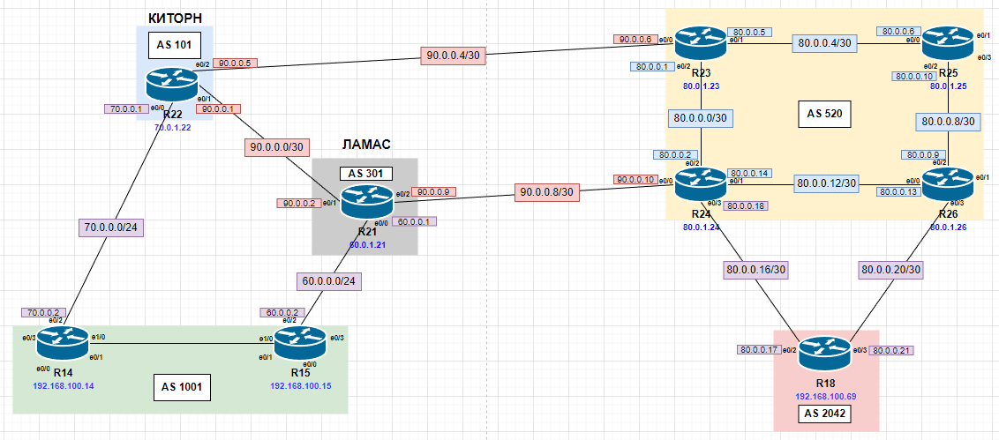

# BGP. Основы

Актуальные схемы сети и таблиц ip-адресации представлены [тут](https://github.com/DemonOfLaziness/otus-labs/tree/main/labs/lab15/Schemes).  
Файл лабораторной и основные конфиги представлены [тут](https://github.com/DemonOfLaziness/otus-labs/tree/main/labs/lab15/Configs).  

Фрагмент общей схемы, на котором будут проводиться работы:  
  

Ход работы

- [Настройка eBGP между офисом Москва и двумя провайдерами - Киторн и Ламас](#настройка-ebgp-между-офисом-москва-и-двумя-провайдерами---киторн-и-ламас)
- [Настройка eBGP между провайдерами Киторн и Ламас](#настройка-ebgp-между-провайдерами-киторн-и-ламас)
- [Настройка eBGP между Ламас и Триада](#настройка-ebgp-между-ламас-и-триада)
- [Настройка eBGP между офисом С.-Петербург и провайдером Триада](#настройка-ebgp-между-офисом-с-петербург-и-провайдером-триада)
- [Организация IP-доступности между пограничными роутерами офиса в Москве и С.-Петербурге](#организация-ip-доступности-между-пограничными-роутерами-офиса-в-москве-и-с-петербурге)

## Настройка eBGP между офисом Москва и двумя провайдерами - Киторн и Ламас

Для настройки eBGP между офисом Москвы и провайдерами необходимо включить BGP на каждом роутере и прописать всех его соседей с их AS. 

Настройка на R22 (провайдер Киторн):  
```
R22(config)#router bgp 101
R22(config-router)#bgp router-id 70.0.1.22
R22(config-router)#neighbor 70.0.0.2 remote-as 1001
```  

Настройка на R21 (провайдер Ламас):  
```
R21(config)#router bgp 301
R21(config-router)#bgp router-id 60.0.1.21
R21(config-router)#neighbor 60.0.0.2 remote-as 1001
```  

Настройка на R14:  
```
R14(config)#router bgp 1001
R14(config-router)#bgp router-id 192.168.100.14
R14(config-router)#neighbor 70.0.0.1 remote-as 101
R14(config-router)#
*Aug 19 09:45:39.834: %BGP-5-ADJCHANGE: neighbor 70.0.0.1 Up
```  
После настройки на R14 сразу установились соседство и появилась запись в консоли об этом.  

Настройка на R15:  
```
R15(config)#router bgp 1001
R15(config-router)#bgp router-id 192.168.100.15
R15(config-router)#neighbor 60.0.0.1 remote-as 301
R15(config-router)#
*Aug 19 09:46:57.806: %BGP-5-ADJCHANGE: neighbor 60.0.0.1 Up 
```  
После настройки на R15 сразу установились соседство и появилась запись в консоли об этом.  

## Настройка eBGP между провайдерами Киторн и Ламас

Для настройки eBGP между провайдерами необходимо включить BGP на каждом роутере и прописать всех его соседей с их AS.  

Настройка на R21 (провайдер Ламас):  
```
R21(config-router)#neighbor 90.0.0.1 remote-as 101
```  

Настройка на R22 (провайдер Киторн):  
```
R22(config-router)#neighbor 90.0.0.2 remote-as 301 
R22(config-router)#                               
*Aug 19 09:41:10.371: %BGP-5-ADJCHANGE: neighbor 90.0.0.2 Up
```  
После настройки на R22 сразу установились соседство и появилась запись в консоли об этом.  

## Настройка eBGP между Ламас и Триада

Для настройки eBGP между провайдерами необходимо включить BGP на каждом роутере и прописать всех его соседей с их AS.  

Настройка на R21 (провайдер Ламас):  
```
R21(config-router)#neighbor 90.0.0.10 remote-as 520
```  

Настройка на R24 (провайдер Триада):  
```
R24(config)#router bgp 520
R24(config-router)#bgp router-id 80.0.1.24
R24(config-router)#neighbor 90.0.0.9 remote-as 301
R24(config-router)#
*Aug 19 09:54:06.524: %BGP-5-ADJCHANGE: neighbor 90.0.0.9 Up 
```  
После настройки на R24 сразу установились соседство и появилась запись в консоли об этом. 

## Настройка eBGP между офисом С.-Петербург и провайдером Триада.

Для настройки eBGP между офисом Санкт-Петербурга и провайдером необходимо включить BGP на каждом роутере и прописать всех его соседей с их AS.  

Настройка на R24 (провайдер Триада):  
```
R24(config-router)#neighbor 80.0.0.17 remote-as 2042
```  

Настройка на R26 (провайдер Триада):  
```
R26(config)#router bgp 520
R26(config-router)#bgp router-id 80.0.1.26
R26(config-router)#neighbor 80.0.0.21 remote-as 2024
```  

Настройка на R18:  
```
R18(config)#router bgp 2042
R18(config-router)#bgp router-id 192.168.100.69
R18(config-router)#neighbor 80.0.0.18 remote-as 520
R18(config-router)#neighbor 80.0.0.22 remote-as 520
R18(config-router)#
*Aug 19 09:58:57.591: %BGP-5-ADJCHANGE: neighbor 80.0.0.18 Up
*Aug 19 09:59:42.344: %BGP-5-ADJCHANGE: neighbor 80.0.0.22 Up 
R18(config-router)#
```  
После настройки на R18 сразу установилось соседство и появилась запись в консоли об этом.

## Организация IP-доступности между пограничными роутерами офиса в Москве и С.-Петербурге

Для организации IP-доступности между двумя офисами необходимо сообщить о подсетях Loopback-ов пограничных маршрутизаторов. Для этого необходимо просто анонсировать их с соответствующих маршрутизаторов.

Настройка на R14:  
```
R14(config-router)#network 192.168.100.14 mask 255.255.255.255
```  

Настройка на R15:  
```
R15(config-router)#network 192.168.100.15 mask 255.255.255.255
```  

Настройка на R18:  
```
R18(config-router)#network 192.168.100.69 mask 255.255.255.255
```  

После настройки нужно проверить доступность маршрутизаторов офисов. Для этого нужно пропинговать их друг от друга.  

Результат пинга R18 с R14:  
```
R14#ping 192.168.100.69 source 192.168.100.14
Type escape sequence to abort.
Sending 5, 100-byte ICMP Echos to 192.168.100.69, timeout is 2 seconds:
Packet sent with a source address of 192.168.100.14 
!!!!!
Success rate is 100 percent (5/5), round-trip min/avg/max = 1/1/2 ms
R14#
```  

Результат пинга R18 с R15:  
```
R15#ping 192.168.100.69 source 192.168.100.15
Type escape sequence to abort.
Sending 5, 100-byte ICMP Echos to 192.168.100.69, timeout is 2 seconds:
Packet sent with a source address of 192.168.100.15 
!!!!!
Success rate is 100 percent (5/5), round-trip min/avg/max = 1/1/1 ms
R15#
```  

Результат пинга R14 и R15 с R18:  
```
R18#ping 192.168.100.14 source 192.168.100.69
Type escape sequence to abort.
Sending 5, 100-byte ICMP Echos to 192.168.100.14, timeout is 2 seconds:
Packet sent with a source address of 192.168.100.69 
!!!!!
Success rate is 100 percent (5/5), round-trip min/avg/max = 1/1/2 ms
R18#ping 192.168.100.15 source 192.168.100.69
Type escape sequence to abort.
Sending 5, 100-byte ICMP Echos to 192.168.100.15, timeout is 2 seconds:
Packet sent with a source address of 192.168.100.69 
!!!!!
Success rate is 100 percent (5/5), round-trip min/avg/max = 1/1/1 ms
R18#
```  

Учитывая удачный результат пинга, можно сделать вывод, что протокол eBGP успешно настроен.