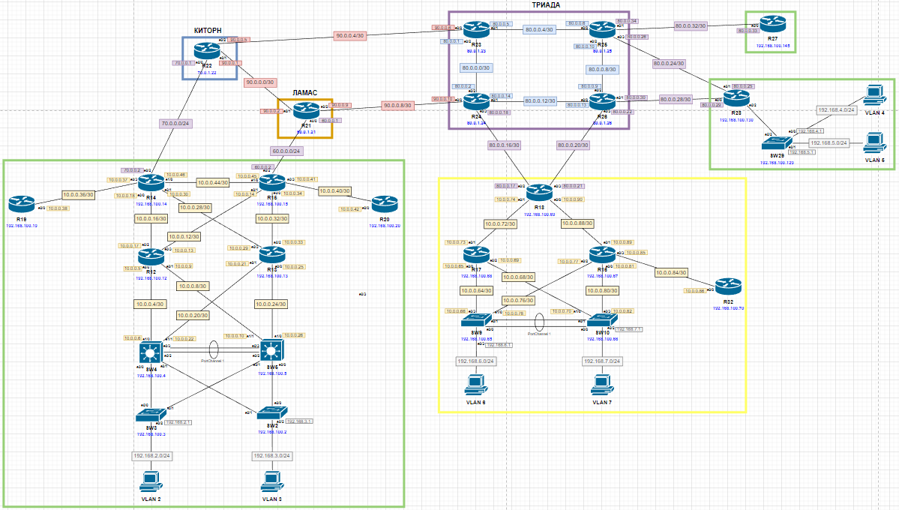

# BGP. Фильтрация

Актуальные схемы сети и таблиц ip-адресации представлены [тут](https://github.com/DemonOfLaziness/otus-labs/tree/main/labs/lab17/Schemes).  
Файл лабораторной и основные конфиги представлены [тут](https://github.com/DemonOfLaziness/otus-labs/tree/main/labs/lab17/Configs).  

Фрагмент общей схемы, на котором будут проводиться работы:  
  

Ход работы

- [Настроить фильтрацию в офисе Москва так, чтобы не появилось транзитного трафика(As-path)](#настроить-фильтрацию-в-офисе-москва-так-чтобы-не-появилось-транзитного-трафикаas-path)
- [Настроить фильтрацию в офисе С.-Петербург так, чтобы не появилось транзитного трафика(Prefix-list)](#настроить-фильтрацию-в-офисе-с-петербург-так-чтобы-не-появилось-транзитного-трафикаprefix-list)
- [Настроить провайдера Киторн так, чтобы в офис Москва отдавался только маршрут по умолчанию](#настроить-провайдера-киторн-так-чтобы-в-офис-москва-отдавался-только-маршрут-по-умолчанию)
- [Настроить провайдера Ламас так, чтобы в офис Москва отдавался только маршрут по умолчанию и префикс офиса С.-Петербург](#настроить-провайдера-ламас-так-чтобы-в-офис-москва-отдавался-только-маршрут-по-умолчанию-и-префикс-офиса-с-петербург)
- [Все сети в лабораторной работе должны иметь IP связность](#все-сети-в-лабораторной-работе-должны-иметь-ip-связность)

## Настроить фильтрацию в офисе Москва так, чтобы не появилось транзитного трафика(As-path)

Для того, чтобы в офисе Москвы не появлялось транзитного трафика, необходимо исключить из анонсов соседу (R22 и R21) любые префиксы, чей AS_PATH не пустой (потому что это означает, что эти маршруты пришли от кого-то, и маршрутизатор офиса просто передаёт их дальше, становясь ещё одним hop-ом в цепочке - а значит участвует в транзите чьего-то постороннего трафика). Для этого нужно создать route-map с as-path access-list и отфильтровать им по условию выше все передаваемые соседу маршруты.  

Настройка на R14 (R15 аналогично):  
```
R14(config)#ip as-path access-list 1 permit ^$
R14(config)#
R14(config)#route-map kitorn_out permit
R14(config-route-map)#match as-path 1
R14(config-route-map)#exi
R14(config)#
R14(config)#router bgp 1001
R14(config-router)#neighbor 70.0.0.1 route-map kitorn_out out
```  

Для проверки результата можно сравнить имеющиеся префиксы до и после настройки фильтрации (различия в таблицах будут указаны ёлочкой - <<<<<<<<<<).  

До фильтрации, R22:  
```
R22#sh ip bgp 
     Network          Next Hop            Metric LocPrf Weight Path
 *>  90.0.0.4/30      0.0.0.0                  0         32768 i
 *   192.168.2.0/23   90.0.0.2                               0 301 1001 i
 *>                   70.0.0.2                 0             0 1001 i
 *   192.168.6.0/23   70.0.0.2                               0 1001 301 520 2042 i  <<<<<<<<<<
 *                    90.0.0.2                               0 301 520 2042 i
 *>                   90.0.0.6                               0 520 2042 i
 *   192.168.100.14/32
                       90.0.0.2                               0 301 1001 i
 *>                   70.0.0.2                 0             0 1001 i
 *   192.168.100.15/32
                       90.0.0.2                               0 301 1001 i
 *>                   70.0.0.2                               0 1001 i
 *   192.168.100.69/32
                       70.0.0.2                               0 1001 301 520 2042 i  <<<<<<<<<<
 *                    90.0.0.2                               0 301 520 2042 i
 *>                   90.0.0.6                               0 520 2042 i
R22#
```  

После фильтрации, R22:  
```
R22#sh ip bgp 
     Network          Next Hop            Metric LocPrf Weight Path
 *>  90.0.0.4/30      0.0.0.0                  0         32768 i
 *   192.168.2.0/23   90.0.0.2                               0 301 1001 i
 *>                   70.0.0.2                 0             0 1001 i
 *   192.168.6.0/23   90.0.0.2                               0 301 520 2042 i   <<<<<<<<<<<<
 *>                   90.0.0.6                               0 520 2042 i
 *   192.168.100.14/32
                       90.0.0.2                               0 301 1001 i
 *>                   70.0.0.2                 0             0 1001 i
 *   192.168.100.15/32
                       90.0.0.2                               0 301 1001 i
 *>                   70.0.0.2                               0 1001 i
 *   192.168.100.69/32
                       90.0.0.2                               0 301 520 2042 i  <<<<<<<<<<<<<
 *>                   90.0.0.6                               0 520 2042 i
R22#
```  

До фильтрации, R21:  
```
R21#sh ip bgp
Network          Next Hop            Metric LocPrf Weight Path
 *   90.0.0.4/30      90.0.0.10                              0 520 101 i
 *>                   90.0.0.1                 0             0 101 i
 *   192.168.2.0/23   90.0.0.1                               0 101 1001 i
 *>                   60.0.0.2                 0             0 1001 i
 *>  192.168.6.0/23   90.0.0.10                              0 520 2042 i
 *                    90.0.0.1                               0 101 520 2042 i
 *>  192.168.100.14/32
                       60.0.0.2                               0 1001 i
 *                    90.0.0.1                               0 101 1001 i
 *   192.168.100.15/32
                       90.0.0.1                               0 101 1001 i
 *>                   60.0.0.2                 0             0 1001 i
 *   192.168.100.69/32
     Network          Next Hop            Metric LocPrf Weight Path
                       90.0.0.1                               0 101 520 2042 i
 *>                   90.0.0.10                              0 520 2042 i
R21#
```  

После фильтрации, R21:  
```
R21#sh ip bgp
     Network          Next Hop            Metric LocPrf Weight Path
 *   90.0.0.4/30      90.0.0.10                              0 520 101 i
 *>                   90.0.0.1                 0             0 101 i
 *   192.168.2.0/23   90.0.0.1                               0 101 1001 i
 *>                   60.0.0.2                 0             0 1001 i
 *   192.168.6.0/23   90.0.0.1                               0 101 520 2042 i
 *>                   90.0.0.10                              0 520 2042 i
 *>  192.168.100.14/32
                       60.0.0.2                               0 1001 i
 *                    90.0.0.1                               0 101 1001 i
 *   192.168.100.15/32
                       90.0.0.1                               0 101 1001 i
 *>                   60.0.0.2                 0             0 1001 i
 *>  192.168.100.69/32
                       90.0.0.10                              0 520 2042 i
 *                    90.0.0.1                               0 101 520 2042 i
R21#
```  
## Настроить фильтрацию в офисе С.-Петербург так, чтобы не появилось транзитного трафика(Prefix-list)

Для того, чтобы в офисе С.-Петербурга не появлялось транзитного трафика, необходимо исключить из анонсов соседям (R24 и R26) любые префиксы, кроме префиксов подсетей офиса. Для этого нужно создать prefix-list и отфильтровать им по условию выше все передаваемые соседу маршруты.  

Настройка на R18:  
```
R18(config)#ip prefix-list triada_out permit 192.168.6.0/23
R18(config)#ip prefix-list triada_out permit 192.168.100.0/24
R18(config)#ip prefix-list triada_out deny 0.0.0.0/0 le 32
R18(config)#
R18(config)#
R18(config)#router bgp 2042
R18(config-router)#neighbor 80.0.0.18 prefix-list triada_out out
R18(config-router)#neighbor 80.0.0.22 prefix-list triada_out out
```  

До фильтрации, R24:  
```
R24#sh ip bgp
     Network          Next Hop            Metric LocPrf Weight Path
 r   90.0.0.4/30      90.0.0.9                               0 301 101 i
 r>i                  90.0.0.5                 0    100      0 101 i
 * i 192.168.2.0/23   90.0.0.5                 0    100      0 101 1001 i
 *>                   90.0.0.9                               0 301 1001 i
 * i 192.168.6.0/23   80.0.0.21          1541120    100      0 2042 i
 *>                   80.0.0.17          1541120             0 2042 i
 *>  192.168.100.14/32
                       90.0.0.9                               0 301 1001 i
 * i                  90.0.0.5                 0    100      0 101 1001 i
 * i 192.168.100.15/32
                       90.0.0.5                 0    100      0 101 1001 i
 *>                   90.0.0.9                               0 301 1001 i
 * i 192.168.100.69/32
                       80.0.0.21                0    100      0 2042 i
 *>                   80.0.0.17                0             0 2042 i
R24#
```  

После фильтрации, R24:  
```
R24#sh ip bgp
     Network          Next Hop            Metric LocPrf Weight Path
 r   90.0.0.4/30      90.0.0.9                               0 301 101 i
 r>i                  90.0.0.5                 0    100      0 101 i
 * i 192.168.2.0/23   90.0.0.5                 0    100      0 101 1001 i
 *>                   90.0.0.9                               0 301 1001 i
 * i 192.168.6.0/23   80.0.0.21          1541120    100      0 2042 i
 *>                   80.0.0.17          1541120             0 2042 i
 *>  192.168.100.14/32
                       90.0.0.9                               0 301 1001 i
 * i                  90.0.0.5                 0    100      0 101 1001 i
 * i 192.168.100.15/32
                       90.0.0.5                 0    100      0 101 1001 i
 *>                   90.0.0.9                               0 301 1001 i
 * i 192.168.100.69/32
                       80.0.0.21                0    100      0 2042 i
 *>                   80.0.0.17                0             0 2042 i
R24#
```  

## Настроить провайдера Киторн так, чтобы в офис Москва отдавался только маршрут по умолчанию

Для настройки маршрута по умолчанию необходимо включить оригинирование default router-а пиру на маршрутизаторе провайдера (R22), а так же отфильтровать при передаче все маршруты, чтобы пир получал исключительно дефолтный маршрут.  

Настройка на R22:  
```
R22(config)#ip prefix-list msk_out deny 0.0.0.0/0 le 32
R22(config)#
R22(config)#router bgp 101
R22(config-router)#neighbor 70.0.0.2 default-originate
R22(config-router)#neighbor 70.0.0.2 prefix-list msk_out out
```  

Для проверки можено сравнить вывод команды *show ip bgp* до и после настройки (различия в таблицах будут указаны ёлочкой - <<<<<<<<<<).  

До настройки, R14:
```
R14#sh ip bgp
     Network          Next Hop            Metric LocPrf Weight Path
 *>i 90.0.0.4/30      60.0.0.1                 0    200      0 301 101 i
 *                    70.0.0.1                 0             0 101 i            <<<<<<<<<<
 * i 192.168.2.0/23   192.168.100.15           0    100      0 i
 *>                   0.0.0.0                  0         32768 i
 *>i 192.168.6.0/23   60.0.0.1                 0    200      0 301 520 2042 i
 *                    70.0.0.1                               0 101 520 2042 i   <<<<<<<<<<
 *>  192.168.100.14/32
                       0.0.0.0                  0         32768 i
 r>i 192.168.100.15/32
                       192.168.100.15           0    100      0 i
 *>i 192.168.100.69/32
                       60.0.0.1                 0    200      0 301 520 2042 i
 *                    70.0.0.1                               0 101 520 2042 i   <<<<<<<<<<
R14#
```  

После настройки, R14:
```
R14#sh ip bgp
     Network          Next Hop            Metric LocPrf Weight Path
 *>  0.0.0.0          70.0.0.1                               0 101 i
 *>i 90.0.0.4/30      60.0.0.1                 0    200      0 301 101 i
 * i 192.168.2.0/23   192.168.100.15           0    100      0 i
 *>                   0.0.0.0                  0         32768 i
 *>i 192.168.6.0/23   60.0.0.1                 0    200      0 301 520 2042 i
 *>  192.168.100.14/32
                       0.0.0.0                  0         32768 i
 r>i 192.168.100.15/32
                       192.168.100.15           0    100      0 i
 *>i 192.168.100.69/32
                       60.0.0.1                 0    200      0 301 520 2042 i
R14#
```  

## Настроить провайдера Ламас так, чтобы в офис Москва отдавался только маршрут по умолчанию и префикс офиса С.-Петербург

Для настройки маршрута по умолчанию необходимо включить оригинирование default router-а пиру на маршрутизаторе провайдера (R21), а так же отфильтровать при передаче все маршруты, кроме префикса Питера.  

Настройка на R15:  
```
R21(config)#ip prefix-list msk_out permit 192.168.6.0/23
R21(config)#ip prefix-list msk_out deny 0.0.0.0/0 le 32
R21(config)#
R21(config)#router bgp 301
R21(config-router)#neighbor 60.0.0.2 default-originate
R21(config-router)#neighbor 60.0.0.2 prefix-list msk_out out
```  

Для проверки можено сравнить вывод команды *show ip bgp* до и после настройки (различия в таблицах будут указаны ёлочкой - <<<<<<<<<<).  

До настройки, R15:  
```
R15#sh ip bgp
     Network          Next Hop            Metric LocPrf Weight Path
 r>i 0.0.0.0          70.0.0.1                 0    100      0 101 i             <<<<<<<<<<
 *>  90.0.0.4/30      60.0.0.1                      200      0 301 101 i         <<<<<<<<<<
 * i 192.168.2.0/23   192.168.100.14           0    100      0 i
 *>                   0.0.0.0                  0         32768 i
 *>  192.168.6.0/23   60.0.0.1                      200      0 301 520 2042 i    
 r>i 192.168.100.14/32
                       192.168.100.14           0    100      0 i
 *>  192.168.100.15/32
                       0.0.0.0                  0         32768 i
 *>  192.168.100.69/32                                                           <<<<<<<<<<
                       60.0.0.1                      200      0 301 520 2042 i
R15# 
```  

После настройки, R15:  
```
R15#sh ip bgp          
     Network          Next Hop            Metric LocPrf Weight Path
 *>  0.0.0.0          60.0.0.1                      200      0 301 i
 * i 192.168.2.0/23   192.168.100.14           0    100      0 i
 *>                   0.0.0.0                  0         32768 i
 *>  192.168.6.0/23   60.0.0.1                      200      0 301 520 2042 i
 r>i 192.168.100.14/32
                       192.168.100.14           0    100      0 i
 *>  192.168.100.15/32
                       0.0.0.0                  0         32768 i
R15#
```   

## Все сети в лабораторной работе должны иметь IP связность

Для проверки связности произведён пинг с компьютера из рабочей сети Москвы до компьютера в Питере и обратно:  
```
msk_user_pc> ping 192.168.6.2

84 bytes from 192.168.6.2 icmp_seq=1 ttl=55 time=3.788 ms
84 bytes from 192.168.6.2 icmp_seq=2 ttl=55 time=3.221 ms
84 bytes from 192.168.6.2 icmp_seq=3 ttl=55 time=3.407 ms
84 bytes from 192.168.6.2 icmp_seq=4 ttl=55 time=2.283 ms
84 bytes from 192.168.6.2 icmp_seq=5 ttl=55 time=3.159 ms

msk_user_pc>
```  
```
spb_user_pc> ping 192.168.2.2

84 bytes from 192.168.2.2 icmp_seq=1 ttl=56 time=3.147 ms
84 bytes from 192.168.2.2 icmp_seq=2 ttl=56 time=6.304 ms
84 bytes from 192.168.2.2 icmp_seq=3 ttl=56 time=4.635 ms
84 bytes from 192.168.2.2 icmp_seq=4 ttl=56 time=2.983 ms
84 bytes from 192.168.2.2 icmp_seq=5 ttl=56 time=3.365 ms

spb_user_pc> 
```  

Можно сделать вывод, что связность присутствует.