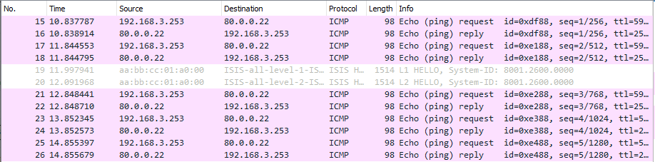
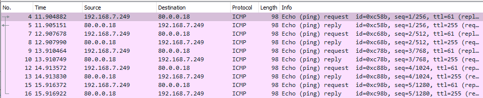
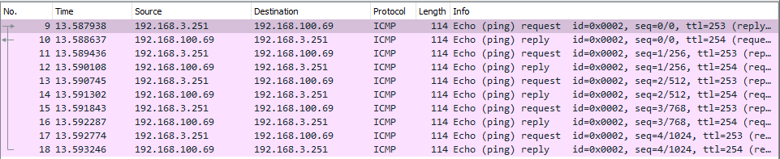
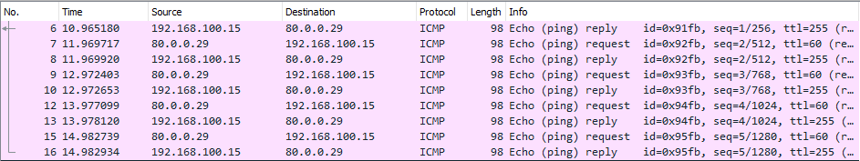

# Основные протоколы сети интернет

Актуальные схемы сети и таблиц ip-адресации представлены [тут](https://github.com/DemonOfLaziness/otus-labs/tree/main/labs/lab18/Schemes).  
Файл лабораторной и основные конфиги представлены [тут](https://github.com/DemonOfLaziness/otus-labs/tree/main/labs/lab18/Configs).  

Общая схема, на которой будут проводиться работы:  
  

Ход работы

- [Настройка для IPv4 DHCP-сервера в офисе Москва. VPC1 и VPC7 должны получать сетевые настройки по DHCP](#настройка-для-ipv4-dhcp-сервера-в-офисе-москва-vpc1-и-vpc7-должны-получать-сетевые-настройки-по-dhcp)
- [Настройка NAT(PAT) на R14 и R15. Трансляция должна осуществляться в адрес автономной системы AS1001](#настройка-natpat-на-r14-и-r15-трансляция-должна-осуществляться-в-адрес-автономной-системы-as1001)
- [Настройка NAT(PAT) на R18. Трансляция должна осуществляться в пул из 5 адресов автономной системы AS2042](#настройка-natpat-на-r18-трансляция-должна-осуществляться-в-пул-из-5-адресов-автономной-системы-as2042)
- [Настройка статического NAT для R20](#настройка-статического-nat-для-r20)
- [Настройка NAT для R19 так, чтобы он был доступен с любого узла для удаленного управления](#настройка-nat-для-r19-так-чтобы-он-был-доступен-с-любого-узла-для-удаленного-управления)
- [Настройка статического NAT(PAT) для офиса Чокурдах](#настройка-статического-natpat-для-офиса-чокурдах)
- [Настройка NTP-сервера на R12 и R13. Все устройства в офисе Москва должны синхронизировать время с R12 и R13](#настройка-ntp-сервера-на-r12-и-r13-все-устройства-в-офисе-москва-должны-синхронизировать-время-с-r12-и-r13)

## Настройка для IPv4 DHCP-сервера в офисе Москва. VPC1 и VPC7 должны получать сетевые настройки по DHCP

Данное задание выполнено не совсем так, как сформулировано. DHCP-сервер для всех офисов был настроен ещё при первоначальной конфигурации устройств в самой первой лабораторной работе. Тогда было решено выделить как DHCP-сервер один коммутатор уровня доступа, а на остальных, при необходимости, пересылать DHCP-запросы от оконечных устройств командой *ip helper-address 192.168.100.X*, где 192.168.100.X - management-ip коммутатора, являющегося DHCP-сервером.  
На коммутаторе были настроены пулы под каждую рабочую подсеть (согласно ip-плану), адрес, являющийся шлюзом рабочей подсети, исключался из раздачи.  

Настройка на SW5 (SW10, R28 аналогично):  
```
SW5(config)#ip dhcp excluded-address 192.168.2.1
SW5(config)#ip dhcp excluded-address 192.168.3.1
SW5(config)#
SW5(config)#
SW5(config)#ip dhcp pool msk_user
SW5(dhcp-config)#network 192.168.2.0 255.255.255.0
SW5(dhcp-config)#default-router 192.168.2.1 
SW5(dhcp-config)#domain-name msk_user
SW5(dhcp-config)#exit
SW5(config)#
SW5(config)#
SW5(config)#ip dhcp pool msk_asup
SW5(dhcp-config)#network 192.168.3.0 255.255.255.0
SW5(dhcp-config)#domain-name msk_asup
SW5(dhcp-config)#default-router 192.168.3.1
SW5(dhcp-config)#exit
```  

Проверка на VPC1:  
```
msk_user_pc> ip dhcp
DORA IP 192.168.2.2/24 GW 192.168.2.1
```  

Проверка на VPC7:  
```
msk_asup_pc> ip dhcp
DORA IP 192.168.3.2/24 GW 192.168.3.1
```  

В остальных офисах аналогично.  

## Настройка NAT(PAT) на R14 и R15. Трансляция должна осуществляться в адрес автономной системы AS1001

Для настройки PAT на R14 и R15 с трансляцией в один адрес, необходимо исключить два адреса (один на каждый натирующий маршрутизатор) из раздачи DHCP, затем включить NAT на интерфейсах, создать NAT-пул с одним адресом и включить трансляцию командой *ip nat inside source...* на маршрутизаторах.  

Настройки на SW5:  
```
SW5(config)#ip dhcp excluded-address 192.168.3.252 192.168.3.253
```  

Настройка на R14 (на R15 аналогично):  
```
R14(config)#int range e0/0-1, e0/3, e1/0
R14(config-if-range)#ip nat inside 

Sep 16 10:35:19.767: %LINEPROTO-5-UPDOWN: Line protocol on Interface NVI0, changed state to up

R14(config-if-range)#exi
R14(config)#
R14(config)#
R14(config)#int e0/2
R14(config-if)#ip nat outside
R14(config)#
R14(config)#
R14(config)#access-li 10 permit 192.168.2.0 0.0.1.255
R14(config)#
R14(config)#
R14(config)#ip nat pool nat_kitorn 192.168.3.252 192.168.3.252 netmask 255.255.254.0
R14(config)#
R14(config)#
R14(config)#ip nat inside source list 10 pool nat_kitorn overload
```  

Для проверки c VPC1 пропингован один из внешних ip офиса в Санкт-Петербурге и на этом интерфейсе отловлены входящие пакеты. По адресу источника echo-request можно сделать вывод, что NAT в офисе Москвы работает.  
  

## Настройка NAT(PAT) на R18. Трансляция должна осуществляться в пул из 5 адресов автономной системы AS2042

Для настройки PAT на R18 с трансляцией в пул из 5 адресов, необходимо исключить эти адреса из раздачи DHCP, затем включить NAT на интерфейсах, создать NAT-пул с пятью адресами и включить трансляцию командой *ip nat inside source...* на маршрутизаторе.  

Настройки на SW10:  
```
SW10(config)#ip dhcp excluded-address 192.168.7.249 192.168.7.253
```  

Настройка на R18:  
```
R18(config)#int range e0/0-1
R18(config-if-range)#ip nat inside 
R18(config-if-range)#exi
R18(config)#int range e0/2-3
R18(config-if-range)#ip nat outside
R18(config-if-range)#exi
R18(config)#
R18(config)#
R18(config)#access-li 10 permit 192.168.6.0 0.0.1.255
R18(config)#
R18(config)#
R18(config)#$ nat_triada 192.168.7.249 192.168.7.253 netmask 255.255.254.0   
R18(config)#
R18(config)#
R18(config)#ip nat inside source list 10 pool nat_triada overload
```  

Для проверки c VPC8 пропингован ip провайдера офиса в Санкт-Петербурге и на этом интерфейсе отловлены входящие пакеты. По адресу источника echo-request можно сделать вывод, что NAT работает.  
  

## Настройка статического NAT для R20

Для настройки статического NAT на R20 необходимо исключить внешний адрес для этого маршрутизатора из раздачи DHCP, затем включить трансляцию командой *ip nat inside source...* на маршрутизаторе.  

Настройки на SW5:  
```
SW5(config)#ip dhcp excluded-address 192.168.3.251 192.168.3.253
```  

Настройка на R15:  
```
R15(config)#ip nat inside source static 192.168.100.20 192.168.3.251
```  

Для проверки c R20 пропингован mgmt-ip пограничного маршрутизатора офиса в Санкт-Петербурге и на этом интерфейсе отловлены входящие пакеты. По адресу источника echo-request можно сделать вывод, что NAT работает.  
  

## Настройка NAT для R19 так, чтобы он был доступен с любого узла для удаленного управления

Для настройки NAT на R19 необходимо пробросить порт ssh так, чтобы при обращении на ip-адрес 192.168.100.14 или 192.168.100.15 по порту 2022 шла переадресация на 192.168.100.19 по порту 22. 

Настройка на R14 (на R15 аналогично):  
```
R14(config)#ip nat inside source static tcp 192.168.100.19 22 192.168.100.14 2022
```  

Так же необходимо настроить ssh-доступ на R19.  
```
R19(config)#username admin privilege 15  secret cisco
R19(config)#ip domain-name msk
R19(config)#crypto key generate rsa
The name for the keys will be: R19.msk
Choose the size of the key modulus in the range of 360 to 4096 for your
  General Purpose Keys. Choosing a key modulus greater than 512 may take
  a few minutes.

How many bits in the modulus [512]: 1024
% Generating 1024 bit RSA keys, keys will be non-exportable...
[OK] (elapsed time was 0 seconds)

R19(config)#
Sep 17 12:00:51.263: %SSH-5-ENABLED: SSH 2.0 has been enabled
R19(config)#
R19(config)#line vty 0 4
R19(config-line)#login local
R19(config-line)#transport input ssh
R19(config-line)#exi
```

Для проверки c R18 произведена попытка ssh-подключения:  
```
R18#ssh -l admin -p 2022 -v 2 192.168.100.14
Password: 
Authorized access only!R19#    
R19#
R19#exit
[Connection to 192.168.100.14 closed by foreign host]
R18#
R18#ssh -l admin -p 2022 -v 2 192.168.100.15
Password: 
Authorized access only!R19#
R19#
R19#exit
[Connection to 192.168.100.15 closed by foreign host]
R18#
```  

По тому, что подключение произошло удачно, можно сделать вывод, что NAT работает.  

## Настройка статического NAT(PAT) для офиса Чокурдах

Для настройки статического NAT дял офиса Чокурдах, необходимо помимо обычный действий, описаных выше, добавить route-map для корректной трансляции NAT в связке с PBR.  

Настройка на R28:  
```
R28(config)#int e0/2.4             
R28(config-subif)#ip nat inside
R28(config-subif)#exi
R28(config)#
R28(config)#int e0/2.5
R28(config-subif)#ip nat inside
R28(config-subif)#exi
R28(config)#
R28(config)#int range e0/0-1
R28(config-if-range)#ip nat outside
R28(config-if-range)#exi
R28(config)#
R28(config)#
R28(config)#access-list 1 permit 192.168.4.0 0.0.1.255  
R28(config)#
R28(config)#
R28(config)#route-map to_isp1 permit 10
R28(config-route-map)#match ip address 1
R28(config-route-map)#match interface e0/1
R28(config-route-map)#exi
R28(config)#
R28(config)#route-map to_isp2 permit 10
R28(config-route-map)#match ip address 1
R28(config-route-map)#match interface e0/0
R28(config-route-map)#exi
R28(config)#
R28(config)#
R28(config)#ip nat inside source route-map to_isp1 interface e0/1 overload 
R28(config)#ip nat inside source route-map to_isp2 interface e0/0 overload
```  

Для проверки c VPC30 пропингован mgmt-ip пограничного маршрутизатора офиса в Москве и на этом интерфейсе отловлены входящие пакеты. По адресу источника echo-request можно сделать вывод, что NAT работает.  
  


## Настройка NTP-сервера на R12 и R13. Все устройства в офисе Москва должны синхронизировать время с R12 и R13

Для настройки NTP-сервера на R12 и R13 необходимо настроить время и включить раздачу NTP, а на получающих время по NTP обозначить сервера NTP.  

Настройки сервера NTP на R13 (R12 аналогично):  
```
R13(config)#clock timezone utc 3 0
R13(config)#clock calendar-valid
R13(config)#ntp master 2
```  

Настройки клиента NTP на R14 (остальные клиенты аналогично):  
```
R14(config)#clock timezone utc 3 0
R14(config)#ntp server 192.168.100.12 prefer
R14(config)#ntp server 192.168.100.13
```  

Проверка раздачи на клиенте:  
```
R14#sh ntp status
Clock is synchronized, stratum 3, reference is 192.168.100.12 
nominal freq is 250.0000 Hz, actual freq is 250.0000 Hz, precision is 2**10
ntp uptime is 24800 (1/100 of seconds), resolution is 4000
reference time is E8AB15D2.8A3D7220 (19:52:34.540 utc Tue Sep 12 2023)
clock offset is 0.0000 msec, root delay is 0.00 msec
root dispersion is 7.99 msec, peer dispersion is 2.78 msec
loopfilter state is 'CTRL' (Normal Controlled Loop), drift is 0.000000000 s/s
system poll interval is 128, last update was 123 sec ago.
```